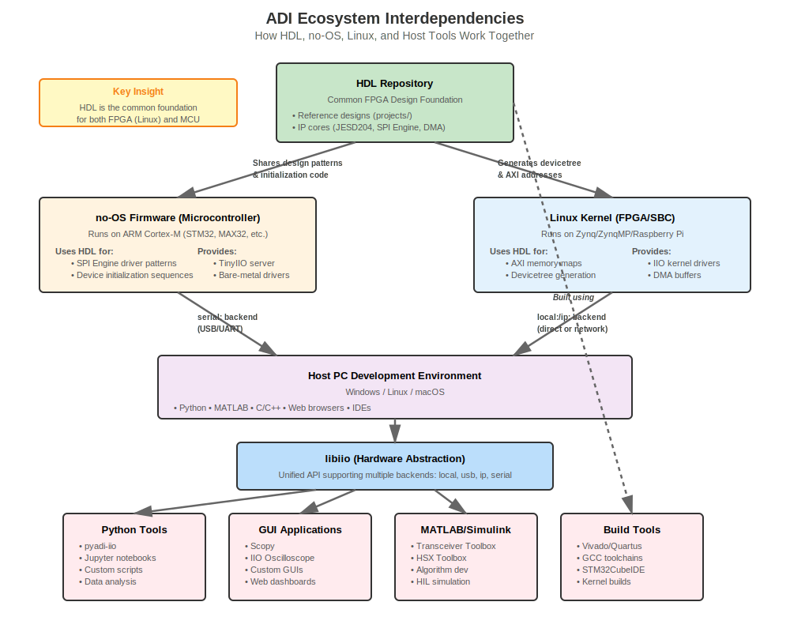
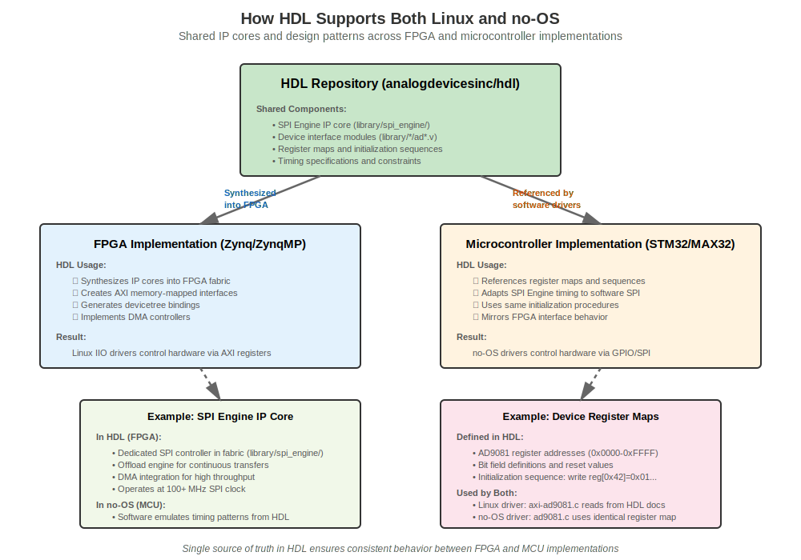

.. _overview_architecture:

Full Stack Architecture
===============================================================================

This page explains the complete architecture of the ADI prototyping ecosystem,
from hardware to applications. Understanding this layered approach will help you
see how the different components work together and where your design fits in.

.. contents:: Contents
   :local:
   :depth: 2

The Seven-Layer Architecture
-------------------------------------------------------------------------------

The ADI ecosystem follows a layered architecture model, where each layer provides
services to the layer above it and consumes services from the layer below. This
separation of concerns makes the system modular, testable, and portable across
different platforms.

.. figure:: architecture-layers.svg
   :align: center
   :width: 600px

   Seven-layer architecture of the ADI prototyping ecosystem

Layer 1: Hardware
~~~~~~~~~~~~~~~~~~~~~~~~~~~~~~~~~~~~~~~~~~~~~~~~~~~~~~~~~~~~~~~~~~~~~~~~~~~~~~~

At the foundation are ADI's analog and mixed-signal devices:

- **Data Converters:** ADCs (SAR, Sigma-Delta, Pipeline) and DACs
- **RF Transceivers:** Wideband transceivers, direct RF sampling converters
- **Sensors:** IMUs, temperature sensors, pressure sensors
- **Timing & Clocking:** PLLs, clock generators, DDS
- **Power Management:** Voltage regulators, power monitors
- **Signal Chain:** Amplifiers, references, switches

These devices communicate with the digital world through standard interfaces:
SPI, I2C, JESD204B/C, LVDS, parallel buses, and more.

Layer 2: Hardware Interface
~~~~~~~~~~~~~~~~~~~~~~~~~~~~~~~~~~~~~~~~~~~~~~~~~~~~~~~~~~~~~~~~~~~~~~~~~~~~~~~

This layer consists of the processor, FPGA, or microcontroller that interfaces
with ADI hardware:

**FPGA Platforms:**

- **Xilinx Zynq/ZynqMP/Versal:** ARM cores + programmable logic
- **Intel (Altera) SoC FPGAs:** ARM cores + programmable logic
- **Standalone FPGAs:** With external processors

**Processor Platforms:**

- **Embedded Linux:** Raspberry Pi, BeagleBone, custom boards
- **Application Processors:** i.MX, Rockchip, AllWinner

**Microcontrollers:**

- **ARM Cortex-M:** STM32, MAX32, NXP, Nordic
- **RISC-V:** SiFive, GigaDevice
- **Other MCUs:** AVR, PIC, MSP430

The choice of platform depends on your requirements for speed, power, cost,
and development environment preferences.

Layer 3: HDL and Firmware
~~~~~~~~~~~~~~~~~~~~~~~~~~~~~~~~~~~~~~~~~~~~~~~~~~~~~~~~~~~~~~~~~~~~~~~~~~~~~~~

This layer provides the HDL (Hardware Description Language) or firmware needed
to interface with ADI devices.

**HDL Components (for FPGAs):**

The :external+hdl:doc:`HDL repository <index>` provides:

- **Reference Designs:** Complete FPGA projects for evaluation boards
- **IP Cores:** Reusable building blocks

  - :external+hdl:doc:`JESD204 <library/jesd204/index>` framework for high-speed serial links
  - :external+hdl:doc:`SPI Engine <library/spi_engine/index>` for efficient SPI communication
  - :external+hdl:doc:`DMA controllers <library/axi_dmac/index>` for high-throughput data movement
  - Device-specific interface cores

- **Common Infrastructure:** Clock management, resets, interrupts, AXI interconnects

**Firmware (for Microcontrollers):**

The :external+no-OS:doc:`no-OS repository <index>` provides:

- **Platform-agnostic drivers:** Works across STM32, MAX32, RISC-V, etc.
- **TinyIIO server:** Lightweight IIO protocol implementation for MCUs
- **Build system:** CMake-based builds for multiple platforms
- **RTOS support:** FreeRTOS, Zephyr integration
- **Example projects:** Complete applications for evaluation boards

Layer 4: Drivers
~~~~~~~~~~~~~~~~~~~~~~~~~~~~~~~~~~~~~~~~~~~~~~~~~~~~~~~~~~~~~~~~~~~~~~~~~~~~~~~

Device drivers provide the software interface to hardware, hiding low-level
register access behind standard APIs.

**Linux IIO Drivers:**

The `IIO (Industrial I/O) <https://www.kernel.org/doc/html/latest/driver-api/iio/index.html>`_
kernel subsystem provides:

- **Standard Interface:** Uniform API across all ADI devices
- **Sysfs Access:** Read/write device attributes via filesystem
- **Buffer Support:** High-speed DMA data capture
- **Trigger System:** Synchronized multi-device sampling
- **Devicetree Integration:** Hardware description and configuration

ADI maintains drivers for hundreds of devices in the mainline Linux kernel.
See the `Linux drivers page <https://wiki.analog.com/resources/tools-software/linux-drivers-all>`_
for the complete list.

**Zephyr Drivers:**

For RTOS-based systems, ADI provides drivers for the `Zephyr Project <https://www.zephyrproject.org/>`_:

- Sensor subsystem integration
- Standard Zephyr APIs
- Devicetree support

**no-OS Drivers:**

For bare-metal microcontroller systems, no-OS drivers provide:

- Direct hardware control
- Minimal overhead
- Platform-agnostic interfaces

Layer 5: Libraries
~~~~~~~~~~~~~~~~~~~~~~~~~~~~~~~~~~~~~~~~~~~~~~~~~~~~~~~~~~~~~~~~~~~~~~~~~~~~~~~

Hardware abstraction libraries provide higher-level access to devices, hiding
the details of drivers and low-level protocols.

**libiio:**

The :external+libiio:doc:`libiio library <index>` is the cornerstone of the software ecosystem:

- **Multiple Backends:**

  - ``local:`` - Direct access to local IIO devices
  - ``usb:`` - USB-connected devices (ADALM2000, PlutoSDR)
  - ``ip:`` - Network-connected devices
  - ``serial:`` - Serial-connected devices (microcontrollers running TinyIIO)
  - ``xml:`` - Saved device descriptions

- **Language Bindings:** C, C++, Python, C#, MATLAB
- **Context Management:** Automatic discovery and connection
- **Buffer Operations:** High-performance data streaming
- **Attribute Access:** Read/write device configuration

With libiio, the same code can access a device whether it's on a local Linux
system, across a network, or connected via USB/serial.

**libm2k:**

For ADALM2000 (M2k) devices, libm2k provides:

- High-level instrument APIs (oscilloscope, signal generator, power supply)
- Calibration management
- Streaming data capture
- Python and C++ bindings

Layer 6: Language Bindings
~~~~~~~~~~~~~~~~~~~~~~~~~~~~~~~~~~~~~~~~~~~~~~~~~~~~~~~~~~~~~~~~~~~~~~~~~~~~~~~

Language bindings provide device-specific, high-level interfaces in various
programming languages.

**pyadi-iio (Python):**

The :external+pyadi-iio:doc:`pyadi-iio library <index>` provides Python classes
for ADI devices:

- **Device-Specific Classes:** ``ad9361``, ``ad4080``, ``ad9081``, etc.
- **NumPy Integration:** Direct access to data as NumPy arrays
- **Property-Based API:** Pythonic attribute access
- **Rapid Prototyping:** Perfect for Jupyter notebooks and scripts

**MATLAB Toolboxes:**

- **Transceiver Toolbox:** Control and data capture for RF transceivers
- **HSX Toolbox:** High-speed ADC/DAC support
- **Simulink Integration:** Hardware-in-the-loop simulation

**C/C++ APIs:**

Direct use of libiio, libm2k, or no-OS libraries for compiled applications.

Layer 7: Applications
~~~~~~~~~~~~~~~~~~~~~~~~~~~~~~~~~~~~~~~~~~~~~~~~~~~~~~~~~~~~~~~~~~~~~~~~~~~~~~~

Complete GUI applications provide turn-key solutions for common tasks.

**Scopy:**

:external+scopy:doc:`Scopy <index>` is a multi-function GUI application providing:

- Oscilloscope interface
- Spectrum analyzer
- Signal generator
- Logic analyzer
- Network analyzer
- Custom device control panels

**IIO Oscilloscope:**

A generic viewer for any IIO device:

- Time-domain plots
- FFT analysis
- Attribute configuration
- Data logging

**Kuiper Linux:**

:doc:`Kuiper Linux </linux/kuiper/index>` is a Debian-based distribution with:

- Pre-installed ADI tools (Scopy, IIO Oscilloscope, pyadi-iio)
- Kernel with ADI drivers
- Configuration for ADI evaluation boards
- Development tools pre-configured

Data Flow Example: AD4080 Precision ADC
-------------------------------------------------------------------------------

Let's trace data flow through all seven layers using the AD4080 40 MSPS ADC as
an example, based on the :doc:`Software Infrastructure tutorial </learning/sw_infrastructure/index>`.

Scenario: Capturing ADC data in Python on a Raspberry Pi, with the AD4080
connected to an STM32 microcontroller via SPI.

.. figure:: dataflow-ad4080.svg
   :align: center
   :width: 700px

   Data flow for AD4080 ADC with STM32 microcontroller

**Layer 1 - Hardware:**
The AD4080 ADC samples analog signals and provides digital data over SPI.

**Layer 2 - Hardware Interface:**
The STM32 microcontroller (ST Nucleo-H563ZI) interfaces with the AD4080's SPI bus,
handles chip selects, and manages data acquisition timing.

**Layer 3 - Firmware:**
The no-OS firmware running on the STM32:

- Initializes the AD4080 (sampling rate, filter configuration)
- Reads samples via SPI
- Packages data in IIO buffer format
- Runs a TinyIIO server on UART

**Layer 4 - Drivers:**
Not needed in this scenario, as the microcontroller talks directly to libiio
via the serial backend.

**Layer 5 - Libraries:**
libiio on the Raspberry Pi:

- Connects to the STM32 via serial backend (``serial:/dev/ttyACM0,230400,8n1``)
- Discovers the AD4080 IIO device
- Provides buffer interface for data streaming

**Layer 6 - Language Bindings:**
pyadi-iio provides the ``ad4080`` Python class:

.. code-block:: python

   import adi

   # Connect to AD4080 via serial
   adc = adi.ad4080(uri="serial:/dev/ttyACM0,230400,8n1")

   # Configure
   adc.sampling_frequency = 1000000  # 1 MSPS
   adc.rx_buffer_size = 4096

   # Capture data
   data = adc.rx()  # Returns NumPy array

**Layer 7 - Applications:**
Scopy or a custom Python script displays and analyzes the data.

This same architecture works for FPGA-based systems, just with HDL at Layer 3
and Linux IIO drivers at Layer 4 instead of firmware and TinyIIO.

Ecosystem Interdependencies
-------------------------------------------------------------------------------

Understanding Component Relationships
~~~~~~~~~~~~~~~~~~~~~~~~~~~~~~~~~~~~~~~~~~~~~~~~~~~~~~~~~~~~~~~~~~~~~~~~~~~~~~~

A key strength of the ADI ecosystem is how components share code and design
patterns across different platforms. The HDL repository serves as a common
foundation for both FPGA-based (Linux) and microcontroller-based (no-OS)
implementations, while host tools work uniformly across both paths through libiio.

   Ecosystem interdependencies showing HDL as common foundation

**Key Relationships:**

**HDL as Common Foundation:**

The HDL repository (analogdevicesinc/hdl) provides:

- **For FPGA/Linux:** IP cores are synthesized into FPGA fabric, generating
  AXI memory maps and devicetree bindings that Linux IIO drivers use
- **For Microcontrollers/no-OS:** Register maps, timing specifications, and
  initialization sequences are referenced by bare-metal drivers

**Host PC Tools - Platform Independent:**

All host-side tools (Python, MATLAB, Scopy, etc.) work identically whether
the device is:

- On a Zynq FPGA running Linux (``local:`` or ``ip:`` backend)
- On a microcontroller running no-OS firmware (``serial:`` backend)
- Connected via USB (``usb:`` backend)

This is achieved through **libiio's abstraction layer**, which presents a
uniform IIO interface regardless of underlying hardware.

How HDL Supports Both Paths
~~~~~~~~~~~~~~~~~~~~~~~~~~~~~~~~~~~~~~~~~~~~~~~~~~~~~~~~~~~~~~~~~~~~~~~~~~~~~~~

The HDL repository contains more than just FPGA designs - it's the reference
implementation for device behavior.

   How HDL IP cores and specifications support both FPGA and MCU paths

**Shared Between FPGA and MCU:**

1. **Device Register Maps:**

   - Defined in HDL documentation and IP cores
   - Linux drivers (``axi-ad9081.c``) and no-OS drivers (``ad9081.c``) use
     identical register addresses and bit fields
   - Ensures consistent device configuration

2. **Initialization Sequences:**

   - Complex devices require specific power-up sequences
   - HDL projects document the correct sequence
   - Both Linux and no-OS drivers follow the same initialization

3. **Timing Specifications:**

   - SPI clock rates, setup/hold times defined in HDL
   - FPGA SPI Engine implements these in hardware
   - no-OS software SPI follows the same timing constraints

4. **Interface Patterns:**

   - JESD204 lane configurations
   - DMA transfer sizes and alignment
   - Interrupt handling sequences

**Platform-Specific Implementations:**

- **FPGA:** HDL IP cores synthesized into programmable logic, high-speed
  parallel processing
- **MCU:** Software drivers on ARM Cortex-M, sequential execution, lower speed
  but lower power

**Result:** The same ADI device (e.g., AD9081) works correctly whether connected
to a Zynq FPGA or an STM32 microcontroller, with host applications seeing the
same IIO interface.

Example: AD9081 Across Platforms
~~~~~~~~~~~~~~~~~~~~~~~~~~~~~~~~~~~~~~~~~~~~~~~~~~~~~~~~~~~~~~~~~~~~~~~~~~~~~~~

Consider the AD9081 MxFE (Mixed-Signal Front End):

**On FPGA (Zynq + Linux):**

1. HDL project (``projects/ad9081_fmca_ebz/zcu102``) synthesizes:

   - JESD204 IP core for multi-gigabit serial links
   - DMA controllers for data streaming
   - AXI interfaces with specific register addresses

2. Linux driver (``axi-ad9081.c``) accesses device via:

   - Memory-mapped AXI registers (programmed by HDL)
   - SPI controller for device configuration
   - DMA buffers for high-throughput data capture

3. Host application uses: ``adi.ad9081(uri="local:")``

**On Microcontroller (STM32 + no-OS):**

1. no-OS firmware references HDL for:

   - Same register map as FPGA implementation
   - Same initialization sequence
   - Same JESD204 configuration (adapted for software)

2. no-OS driver (``ad9081.c``) accesses device via:

   - GPIO bit-banging or hardware SPI peripheral
   - TinyIIO server on USB CDC (serial)
   - Circular buffers for data capture

3. Host application uses: ``adi.ad9081(uri="serial:/dev/ttyACM0,230400,8n1")``

**Identical from Host Perspective:**

.. code-block:: python

   # Same Python code works for both platforms
   mxfe.rx_sample_rate = 4000000000  # 4 GSPS
   mxfe.rx_enabled_channels = [0, 1]
   data = mxfe.rx()

   # libiio handles backend differences transparently

Design Philosophy
-------------------------------------------------------------------------------

Key Principles
~~~~~~~~~~~~~~~~~~~~~~~~~~~~~~~~~~~~~~~~~~~~~~~~~~~~~~~~~~~~~~~~~~~~~~~~~~~~~~~

**1. Leverage Existing Ecosystems**

Rather than creating proprietary frameworks, ADI integrates with established
open-source ecosystems:

- Linux kernel IIO subsystem
- Python scientific computing stack (NumPy, SciPy, Matplotlib)
- MATLAB and Simulink
- Standard FPGA toolchains

This means you can use familiar tools and integrate with existing workflows.

**2. Standard Interfaces**

All ADI device drivers expose standard interfaces:

- IIO sysfs attributes in Linux
- Standard IIO buffer interface
- JESD204 for high-speed serial links
- TinyIIO protocol for microcontrollers

You can write code once and reuse it across different devices.

**3. Portability**

The same high-level code works across platforms:

- libiio abstracts backend differences (local, network, USB, serial)
- pyadi-iio code runs on Linux, Windows, macOS
- no-OS firmware compiles for STM32, MAX32, RISC-V, etc.

**4. Modularity**

Each layer has well-defined interfaces:

- Swap FPGA platforms without changing HDL IP cores
- Replace the processor without changing application code
- Mix and match components as needed

**5. Open Source**

Most ecosystem components are open source:

- HDL reference designs on `GitHub <https://github.com/analogdevicesinc/hdl>`_
- Linux kernel drivers in mainline
- libiio, pyadi-iio, no-OS on GitHub
- Active community contributions

Why the IIO Framework?
~~~~~~~~~~~~~~~~~~~~~~~~~~~~~~~~~~~~~~~~~~~~~~~~~~~~~~~~~~~~~~~~~~~~~~~~~~~~~~~

The `Industrial I/O (IIO) <https://www.kernel.org/doc/html/latest/driver-api/iio/index.html>`_
subsystem is central to the ADI architecture. It is not the only kernel subsystem that ADI uses or authors drivers within, but it is the most widely applicable for many ADI products to date. IIO is used for a number of reasons:

**Standard Interface:**
All ADI devices present a uniform interface, whether they're ADCs, DACs, IMUs,
or sensors. Learn it once, use it everywhere.

**Kernel Integration:**
IIO is part of the mainline Linux kernel, maintained by the kernel community.
Drivers go through rigorous review and testing.

**High Performance:**
IIO's buffer interface supports:

- DMA for zero-copy data movement
- Triggered sampling for synchronization
- Watermark-based interrupts for efficient CPU usage

**Extensibility:**
IIO's attribute system allows device-specific features without breaking the
standard interface.

**Cross-Platform:**
TinyIIO brings the IIO protocol to microcontrollers, so the same software stack
works on Linux and bare-metal systems.

Platform Considerations
-------------------------------------------------------------------------------

Choosing the Right Platform
~~~~~~~~~~~~~~~~~~~~~~~~~~~~~~~~~~~~~~~~~~~~~~~~~~~~~~~~~~~~~~~~~~~~~~~~~~~~~~~

.. list-table::
   :header-rows: 1
   :widths: 15 25 30 30

   * - Platform
     - Best For
     - Advantages
     - Considerations
   * - **FPGA (Zynq, ZynqMP, Cyclone, Stratix)**
     - High-speed data converters, custom signal processing, multiple devices
     - Parallel processing, low latency, flexible I/O, Linux + FPGA fabric
     - Higher cost, power, complexity; requires HDL knowledge
   * - **Microcontroller (STM32, MAX32)**
     - Precision measurement, low power, standalone operation, embedded
     - Low cost, low power, real-time, simple deployment
     - Limited processing, slower interfaces, bare-metal or RTOS
   * - **Raspberry Pi / SBC**
     - Prototyping, learning, demos, multi-device setups
     - Low cost, easy to use, full Linux, Python, MATLAB support
     - Limited I/O, no hard real-time, USB/Ethernet connectivity

**Decision Factors:**

- **Sample Rate:** >100 MSPS typically needs FPGA
- **Signal Processing:** FFTs, filtering, custom algorithms favor FPGA
- **Power Budget:** Microcontrollers for battery operation
- **Ease of Development:** Raspberry Pi for rapid prototyping
- **Cost:** Microcontrollers < Raspberry Pi < FPGAs
- **I/O Requirements:** Multiple devices, custom protocols need FPGAs

See :doc:`workflows` for detailed examples of each platform type.

Migration Paths
~~~~~~~~~~~~~~~~~~~~~~~~~~~~~~~~~~~~~~~~~~~~~~~~~~~~~~~~~~~~~~~~~~~~~~~~~~~~~~~

The layered architecture enables straightforward migration between platforms:

**Prototype to Production:**

1. Start with Raspberry Pi + Arduino shield for proof of concept
2. Test algorithms in Python with pyadi-iio
3. Move to microcontroller with no-OS for cost reduction
4. Or move to FPGA for performance scaling

**The code at layers 5-7 remains largely unchanged** - just switch the libiio
backend URI.

**Example Migration:**

.. code-block:: python

   # Prototype on Raspberry Pi (local driver)
   adc = adi.ad4080(uri="local:")

   # Test with remote STM32 (serial backend)
   adc = adi.ad4080(uri="serial:/dev/ttyACM0,230400,8n1")

   # Deploy with network-connected Zynq (network backend)
   adc = adi.ad4080(uri="ip:192.168.1.100")

The data capture code remains identical.

See Also
-------------------------------------------------------------------------------

**Next Steps:**

- :doc:`components` - Detailed information about each ecosystem component
- :doc:`workflows` - Concrete examples showing components working together
- :doc:`versioning-support` - Version compatibility and support

**Hands-On Learning:**

- :doc:`Software Infrastructure Tutorial </learning/sw_infrastructure/index>` - Complete AD4080 example
- :doc:`FPGA Integration Journey </learning/workshop_a_precision_converter_fpga_integration_journey/index>` - HDL deep dive
- :doc:`IIO 101 Tutorial </learning/tutorial/converter_connectivity/iio_101_tutorial/index>` - IIO framework basics

**External References:**

- `HDL User Guide <https://analogdevicesinc.github.io/hdl/user_guide/index.html>`_
- `Linux Kernel IIO Documentation <https://www.kernel.org/doc/html/latest/driver-api/iio/index.html>`_
- `libiio Documentation <https://analogdevicesinc.github.io/libiio/v0.25/index.html>`_
- `no-OS Documentation <https://analogdevicesinc.github.io/no-OS/index.html>`_
