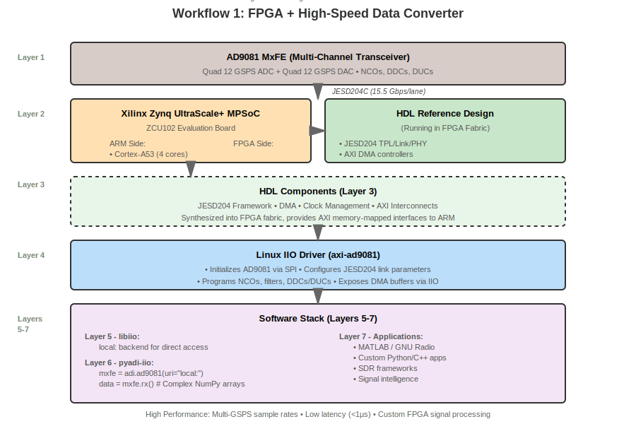
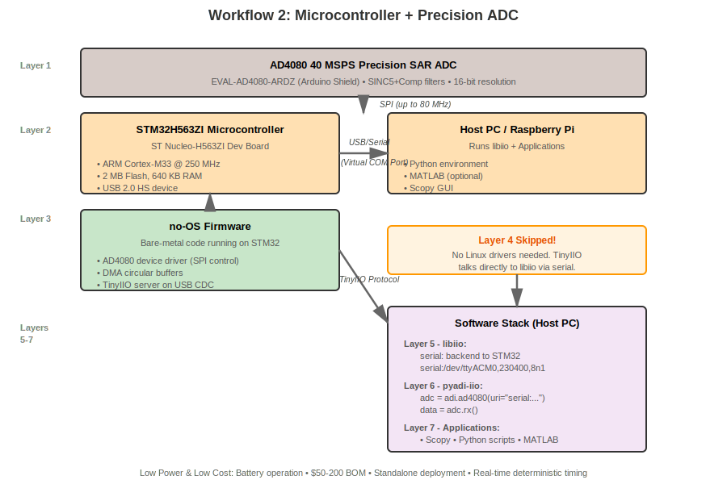
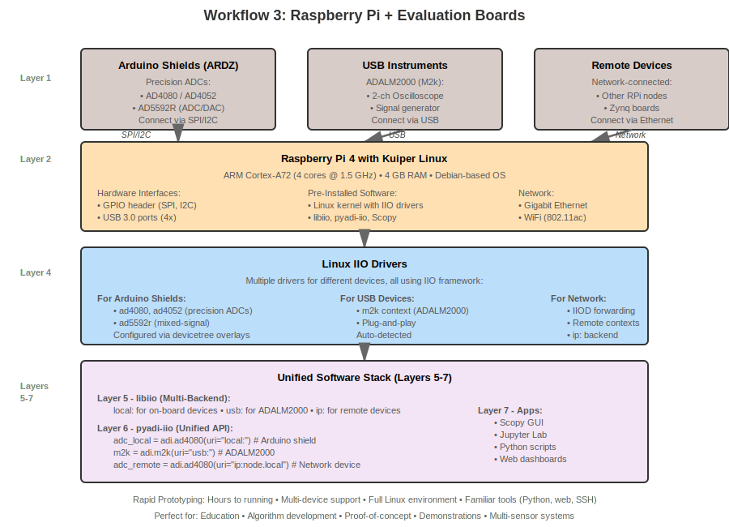

.. _overview_workflows:

Common Development Workflows
===============================================================================

This page shows concrete examples of how ADI ecosystem components work together
in real-world development scenarios. Each workflow demonstrates a complete path
from hardware to application, illustrating which components are used and how
they integrate.

.. contents:: Contents
   :local:
   :depth: 2

Introduction
-------------------------------------------------------------------------------

The ADI ecosystem supports three primary development workflows, each optimized
for different use cases:

1. **FPGA + High-Speed Data Converter** - For high-performance applications
   requiring GSPS sample rates, custom signal processing, or multiple devices

2. **Microcontroller + Precision ADC** - For cost-effective, low-power
   standalone measurement systems

3. **Raspberry Pi + Evaluation Board** - For rapid prototyping, education,
   and demonstration systems

Understanding these workflows will help you choose the right approach for your
project and see how the :doc:`technology stack components <components>` fit together.

Technology Stack Deviations: Linux vs. no-OS
~~~~~~~~~~~~~~~~~~~~~~~~~~~~~~~~~~~~~~~~~~~~~~~~~~~~~~~~~~~~~~~~~~~~~~~~~~~~~~~

System support will deviate at the driver layers for the same hardware depending
on system use and popularity. For example, a high-speed data converter connected
to an FPGA will typically support both Linux drivers and bare-metal projects.
This is the case for AD9081, ADRV9009, and many other devices.

.. figure:: workflow-linux-noos.svg
   :align: center
   :width: 800px

   Linux vs. no-OS development paths: same hardware, different software stacks

**Recommended Approach: Start with Linux**

In these cases, it is always recommended to use the Linux drivers first, and
then move to bare-metal projects if the use case requires it.

.. list-table:: Linux vs. no-OS Comparison
   :header-rows: 1
   :widths: 15 42 43

   * - Aspect
     - Linux
     - no-OS (Bare-Metal)
   * - **Best For**
     - Prototyping, validation, algorithm development
     - Production deployment, resource-constrained systems
   * - **Strengths**
     - | - More guardrails and error checking
       | - Rich debugging (iio_info, oscilloscope, Scopy)
       | - Direct MATLAB/Python/pyadi-iio connectivity
       | - Faster iteration during development
     - | - Minimal footprint, instant boot
       | - Deterministic real-time performance
       | - Lower power consumption
       | - Production-ready, deployable firmware
   * - **Weaknesses**
     - | - Higher resource usage (RAM, CPU, storage)
       | - Non-deterministic timing due to OS scheduling
       | - Longer boot time
     - | - Steeper learning curve
       | - Limited debugging tools
       | - Manual integration with host applications

**Transition Path**

Once the use case is proven and the developer is comfortable with the device,
they can move to bare-metal projects for a more optimized deployable solution.
The typical workflow is:

1. **Prototype with Linux** - Validate device functionality, develop algorithms,
   and test signal chains using the rich Linux ecosystem
2. **Port to no-OS** - Once requirements are locked, port the application logic
   to bare-metal for deployment, reusing the same HDL design and device drivers

Workflow 1: FPGA + High-Speed Data Converter
-------------------------------------------------------------------------------

This workflow targets high-performance applications using Xilinx Zynq/ZynqMP
SoCs with ADI's high-speed data converters like RF transceivers or multi-GSPS
ADCs/DACs.

Use Case Example: AD9081 MxFE Software-Defined Radio
~~~~~~~~~~~~~~~~~~~~~~~~~~~~~~~~~~~~~~~~~~~~~~~~~~~~~~~~~~~~~~~~~~~~~~~~~~~~~~~

**Hardware:**

- Xilinx ZCU102 (Zynq UltraScale+ MPSoC)
- AD9081-FMCA-EBZ evaluation board (Quad 12 GSPS ADC, Quad 12 GSPS DAC)
- JESD204B/C high-speed serial links (up to 15.5 Gbps per lane)

**Application:** Multi-channel wideband transceiver for communications,
radar, or test equipment.

   FPGA workflow: Zynq + AD9081 MxFE via JESD204C

Architecture
~~~~~~~~~~~~~~~~~~~~~~~~~~~~~~~~~~~~~~~~~~~~~~~~~~~~~~~~~~~~~~~~~~~~~~~~~~~~~~~

**Layer 1 - Hardware:**
AD9081 MxFE provides 4 ADC channels (up to 4 GSPS each) and 4 DAC channels
(up to 12 GSPS each) with digital signal processing (NCOs, filters, DDCs, DUCs).

**Layer 2 - Hardware Interface:**
Zynq UltraScale+ MPSoC combines:

- ARM Cortex-A53 processors (4 cores) running Linux
- Programmable logic (FPGA fabric) for JESD204 and signal processing
- High-speed transceivers (GTH) for multi-gigabit serial links

**Layer 3 - HDL:**
The :external+hdl:doc:`AD9081 HDL project <projects/ad9081_fmca_ebz/index>` provides:

- :external+hdl:doc:`JESD204 TPL/Link/PHY <library/jesd204/index>` implementation
- DMA controllers for moving data to/from ARM processors
- Clock management and synchronization
- AXI interfaces to Linux

**Layer 4 - Linux Drivers:**
The ``axi-ad9081`` IIO driver:

- Initializes AD9081 via SPI
- Configures JESD204 link (lane rates, lane count, scrambling)
- Programs digital filters, NCOs, DDCs/DUCs
- Exposes DMA buffers for high-throughput streaming

**Layer 5 - libiio:**
Provides ``local:`` backend for direct access to IIO devices on the Zynq.

**Layer 6 - pyadi-iio:**
The ``adi.ad9081`` Python class:

.. code-block:: python

   import adi
   import numpy as np
   import matplotlib.pyplot as plt

   # Create AD9081 object (on local Zynq)
   mxfe = adi.ad9081(uri="local:")

   # Configure receiver
   mxfe.rx_enabled_channels = [0, 1]  # Enable 2 channels
   mxfe.rx_buffer_size = 2**16

   # Receive data
   data = mxfe.rx()  # Returns complex NumPy array

   # Plot spectrum
   fft = np.fft.fftshift(np.fft.fft(data[0]))
   plt.plot(20*np.log10(np.abs(fft)))
   plt.show()

**Layer 7 - Application:**
MATLAB, GNU Radio, or custom Python/C++ applications for SDR, spectrum monitoring,
or signal intelligence.

Development Steps
~~~~~~~~~~~~~~~~~~~~~~~~~~~~~~~~~~~~~~~~~~~~~~~~~~~~~~~~~~~~~~~~~~~~~~~~~~~~~~~

1. **Hardware Setup:**

   - Mount AD9081-FMCA-EBZ on ZCU102 FMC connector
   - Connect clocks, power, and signal sources
   - Ensure proper termination and grounding

2. **Build HDL Project:**

   Follow :external+hdl:doc:`build instructions <user_guide/build_hdl>`:

   .. code-block:: bash

      git clone https://github.com/analogdevicesinc/hdl
      cd hdl/projects/ad9081_fmca_ebz/zcu102
      make

   This generates a Vivado project and builds the bitstream.

3. **Build Linux Kernel:**

   Use :doc:`Kuiper Linux </linux/kuiper/index>` or build with :doc:`PetaLinux </linux/kernel/petalinux>`.
   The ``axi-ad9081`` driver is included in ADI's kernel.

4. **Program and Boot:**

   - Program FPGA bitstream
   - Copy BOOT.BIN and image.ub to SD card
   - Boot Linux on Zynq

5. **Verify IIO Devices:**

   .. code-block:: bash

      iio_info
      # Should show axi-ad9081 devices

6. **Develop Application:**

   Use pyadi-iio, MATLAB, or C/C++ with libiio to stream data.

When to Use This Workflow
~~~~~~~~~~~~~~~~~~~~~~~~~~~~~~~~~~~~~~~~~~~~~~~~~~~~~~~~~~~~~~~~~~~~~~~~~~~~~~~

Choose FPGA-based workflow when you need:

- **High Sample Rates:** >100 MSPS, up to 12+ GSPS
- **Low Latency:** <1 µs signal processing latency
- **Multiple Devices:** Synchronizing several converters
- **Custom Processing:** FFTs, filtering, beamforming in FPGA fabric
- **High Bandwidth:** JESD204 multi-gigabit links
- **Scalability:** Room to grow with additional logic

**Typical Applications:**

- Software-defined radio platforms
- Phased array radar systems
- 5G/6G test equipment
- Satellite communications
- Medical imaging (MRI, ultrasound)
- High-energy physics instrumentation

**Trade-offs:**

- Higher cost ($1K-$10K+ for evaluation boards)
- More complex (requires FPGA knowledge for customization)
- Higher power consumption (5-50W)
- Longer development time
- Requires specialized tools (Vivado, PetaLinux)

Reference Documentation
~~~~~~~~~~~~~~~~~~~~~~~~~~~~~~~~~~~~~~~~~~~~~~~~~~~~~~~~~~~~~~~~~~~~~~~~~~~~~~~

- **Project Page:** :external+hdl:doc:`AD9081 FMCA EBZ <projects/ad9081_fmca_ebz/index>`
- **HDL User Guide:** `HDL Documentation <https://analogdevicesinc.github.io/hdl/user_guide/index.html>`_
- **Linux Driver:** `axi-ad9081 driver <https://wiki.analog.com/resources/tools-software/linux-drivers/iio-mxfe/ad9081>`_
- **Similar Projects:** :external+hdl:doc:`All HDL Projects <projects/index>`

Workflow 2: Microcontroller + Precision ADC
-------------------------------------------------------------------------------

This workflow targets cost-effective, low-power standalone measurement systems
using bare-metal microcontrollers with precision ADCs.

Use Case Example: AD4080 Precision Data Logger
~~~~~~~~~~~~~~~~~~~~~~~~~~~~~~~~~~~~~~~~~~~~~~~~~~~~~~~~~~~~~~~~~~~~~~~~~~~~~~~

**Hardware:**

- ST Nucleo-H563ZI development board (STM32H563ZI MCU, ARM Cortex-M33, 250 MHz)
- EVAL-AD4080-ARDZ evaluation board (40 MSPS SAR ADC, Arduino form factor)
- SPI interface (up to 80 MHz)
- USB connection to host PC for data streaming

**Application:** Portable seismic sensor, vibration monitor, or precision
measurement instrument.

This example is based on the :doc:`Software Infrastructure Tutorial </learning/sw_infrastructure/index>`.

   Microcontroller workflow: STM32 + AD4080 ADC via SPI and TinyIIO

Architecture
~~~~~~~~~~~~~~~~~~~~~~~~~~~~~~~~~~~~~~~~~~~~~~~~~~~~~~~~~~~~~~~~~~~~~~~~~~~~~~~

**Layer 1 - Hardware:**
AD4080 40 MSPS oversampling SAR ADC with integrated digital filters (SINC5,
SINC5+Comp, Averaging).

**Layer 2 - Hardware Interface:**
STM32H563ZI microcontroller provides:

- High-speed SPI (up to 100 MHz capable)
- USB 2.0 HS device (for TinyIIO over USB CDC)
- DMA controllers for efficient data movement
- 2 MB flash, 640 KB RAM

**Layer 3 - no-OS Firmware:**
The :external+no-OS:doc:`AD4080 no-OS project <index>` provides:

- SPI driver for STM32 HAL
- AD4080 device driver (register configuration, data capture)
- TinyIIO server running on USB CDC (virtual serial port)
- DMA-based circular buffers for continuous capture

**Layer 4 - Drivers:**
*Not used* - TinyIIO on the MCU communicates directly with libiio via serial
protocol, bypassing the need for kernel drivers.

**Layer 5 - libiio:**
Uses ``serial:`` backend to connect to STM32 over USB:

.. code-block:: bash

   # From host PC (Raspberry Pi, laptop, etc.)
   iio_info -u serial:/dev/ttyACM0,230400,8n1

**Layer 6 - pyadi-iio:**
The ``adi.ad4080`` Python class:

.. code-block:: python

   import adi

   # Connect to AD4080 via serial (MCU appears as /dev/ttyACM0)
   adc = adi.ad4080(uri="serial:/dev/ttyACM0,230400,8n1")

   # Configure filter
   adc.filter_type = "sinc5_plus_compensation"
   adc.sampling_frequency = 1000000  # 1 MSPS
   adc.rx_buffer_size = 4096

   # Capture data
   data = adc.rx()  # NumPy array

**Layer 7 - Application:**
Scopy for interactive testing, or custom Python scripts for data logging and
analysis.

Development Steps
~~~~~~~~~~~~~~~~~~~~~~~~~~~~~~~~~~~~~~~~~~~~~~~~~~~~~~~~~~~~~~~~~~~~~~~~~~~~~~~

1. **Hardware Setup:**

   - Mount EVAL-AD4080-ARDZ on ST Nucleo (Arduino headers)
   - Connect signal source (function generator, sensor)
   - Connect Nucleo USB to host PC

2. **Build Firmware:**

   .. code-block:: bash

      git clone https://github.com/analogdevicesinc/no-OS
      cd no-OS/projects/ad4080
      mkdir build && cd build
      cmake .. -DPLATFORM=stm32
      make

   Or use STM32CubeIDE to import project.

3. **Flash Firmware:**

   Use ST-LINK programmer (built into Nucleo):

   .. code-block:: bash

      st-flash write ad4080_project.bin 0x8000000

4. **Verify Connection:**

   From host PC:

   .. code-block:: bash

      iio_info -u serial:/dev/ttyACM0,230400,8n1
      # Should show ad4080 IIO device

5. **Develop Application:**

   Use Scopy, pyadi-iio, or MATLAB to control device and capture data.

When to Use This Workflow
~~~~~~~~~~~~~~~~~~~~~~~~~~~~~~~~~~~~~~~~~~~~~~~~~~~~~~~~~~~~~~~~~~~~~~~~~~~~~~~

Choose microcontroller-based workflow when you need:

- **Low Cost:** MCU boards $10-$50, total BOM $50-$200
- **Low Power:** <1W typical, battery operation feasible
- **Standalone Operation:** No OS, boots instantly
- **Real-Time Performance:** Deterministic timing
- **Simple Deployment:** Single binary, no updates
- **Portability:** Handheld, wearable applications

**Typical Applications:**

- Portable medical devices (ECG, pulse oximetry)
- Industrial sensors (temperature, pressure, vibration)
- Data loggers (environmental monitoring)
- Precision measurement tools
- Battery-powered instrumentation
- Embedded control systems

**Trade-offs:**

- Lower sample rates (<100 MSPS typically)
- Limited processing (no FFTs, complex algorithms)
- Simpler UI (limited display options)
- Serial/USB bottleneck for data streaming
- Manual firmware updates

Reference Documentation
~~~~~~~~~~~~~~~~~~~~~~~~~~~~~~~~~~~~~~~~~~~~~~~~~~~~~~~~~~~~~~~~~~~~~~~~~~~~~~~

- **Tutorial:** :doc:`Software Infrastructure Tutorial </learning/sw_infrastructure/index>`
- **no-OS Framework:** `no-OS Documentation <https://analogdevicesinc.github.io/no-OS/index.html>`_
- **AD4080 Driver:** :external+no-OS:doc:`AD4080 no-OS driver <index>`
- **Similar Designs:** :doc:`Precision ADC Reference Designs </solutions/reference-designs/index>`

Workflow 3: Raspberry Pi + Evaluation Board
-------------------------------------------------------------------------------

This workflow targets rapid prototyping, education, and demonstration using
Raspberry Pi with Arduino-compatible evaluation boards or USB devices.

Use Case Example: Multi-Sensor Data Acquisition
~~~~~~~~~~~~~~~~~~~~~~~~~~~~~~~~~~~~~~~~~~~~~~~~~~~~~~~~~~~~~~~~~~~~~~~~~~~~~~~

**Hardware:**

- Raspberry Pi 4 (4 GB RAM)
- SD card with Kuiper Linux
- Multiple Arduino-shield evaluation boards (ARDZ)
- Optional: ADALM2000 USB multi-function instrument

**Application:** Educational lab setup, proof-of-concept prototyping, or
conference demonstration.

   Raspberry Pi workflow: RPi + Arduino shields and USB devices

Architecture
~~~~~~~~~~~~~~~~~~~~~~~~~~~~~~~~~~~~~~~~~~~~~~~~~~~~~~~~~~~~~~~~~~~~~~~~~~~~~~~

**Layer 1 - Hardware:**
Various ADI devices on Arduino shields:

- AD4052/AD4080 (precision ADCs)
- AD5592R (ADC/DAC/GPIO)
- ADXL345 (accelerometer)
- ADALM2000 (USB multi-function instrument)

**Layer 2 - Hardware Interface:**
Raspberry Pi 4 provides:

- GPIO header (SPI, I2C buses)
- USB 3.0 ports
- Gigabit Ethernet
- ARM Cortex-A72 (4 cores, 1.5 GHz)

**Layer 3 - HDL/Firmware:**
*Not applicable* - Direct SPI/I2C from processor, no FPGA or MCU firmware.

**Layer 4 - Linux IIO Drivers:**
Kuiper Linux includes pre-loaded drivers:

- ``ad4052``/``ad4080`` for precision ADCs
- ``ad5592r`` for mixed-signal device
- ``adxl345`` for accelerometer
- ``m2k`` context for ADALM2000

Devicetree overlays configure SPI chip selects and pin assignments.

**Layer 5 - libiio:**
Multiple backend types on same system:

- ``local:`` for on-board IIO devices (SPI/I2C shields)
- ``usb:`` for ADALM2000
- ``ip:`` for remote devices

**Layer 6 - pyadi-iio:**
Unified Python interface:

.. code-block:: python

   import adi

   # Local SPI device
   adc = adi.ad4080(uri="local:")

   # USB device
   m2k = adi.m2k(uri="usb:")

   # Remote device
   remote_sensor = adi.adxl345(uri="ip:sensor-node.local")

   # Capture from all simultaneously
   adc_data = adc.rx()
   m2k_data = m2k.rx()
   accel_data = remote_sensor.rx()

**Layer 7 - Applications:**
Full desktop Linux environment:

- Scopy for ADALM2000 control
- IIO Oscilloscope for generic devices
- Jupyter Lab for interactive Python
- Custom web servers for remote monitoring

Development Steps
~~~~~~~~~~~~~~~~~~~~~~~~~~~~~~~~~~~~~~~~~~~~~~~~~~~~~~~~~~~~~~~~~~~~~~~~~~~~~~~

1. **Setup Kuiper Linux:**

   - Download image from :doc:`Kuiper Linux page </linux/kuiper/index>`
   - Write to SD card with balenaEtcher or dd
   - Boot Raspberry Pi

2. **Configure Hardware:**

   Mount Arduino shields on GPIO header. For custom boards, enable devicetree
   overlay:

   .. code-block:: bash

      sudo dtoverlay spi0-1cs  # Enable SPI with 1 chip select
      # Edit /boot/config.txt to make permanent

3. **Verify Devices:**

   .. code-block:: bash

      iio_info
      # Should show all connected IIO devices

4. **Install Additional Software:**

   .. code-block:: bash

      pip install additional-libraries
      sudo apt install useful-tools

5. **Develop Application:**

   Use Jupyter Lab, Python scripts, or MATLAB (via remote access) to control
   devices and visualize data.

When to Use This Workflow
~~~~~~~~~~~~~~~~~~~~~~~~~~~~~~~~~~~~~~~~~~~~~~~~~~~~~~~~~~~~~~~~~~~~~~~~~~~~~~~

Choose Raspberry Pi workflow when you need:

- **Rapid Prototyping:** Get running in minutes
- **Education:** Teach data acquisition and signal processing
- **Demonstrations:** Conference booths, customer visits
- **Multi-Device Systems:** Integrate several evaluation boards
- **Familiar Environment:** Standard Linux, Python, web browsers
- **Low Barrier:** Minimal specialized knowledge required

**Typical Applications:**

- University laboratory setups
- Algorithm development and validation
- Proof-of-concept demonstrations
- Trade show exhibits
- Remote monitoring stations
- Hobbyist projects

**Trade-offs:**

- Medium sample rates (<10 MSPS typical on SPI)
- No hard real-time guarantees
- Limited I/O (shared SPI bus, limited chip selects)
- Networking dependencies for remote access
- SD card reliability concerns

Reference Documentation
~~~~~~~~~~~~~~~~~~~~~~~~~~~~~~~~~~~~~~~~~~~~~~~~~~~~~~~~~~~~~~~~~~~~~~~~~~~~~~~

- **Kuiper Linux:** :doc:`Kuiper Linux Guide </linux/kuiper/index>`
- **Raspberry Pi Setup:** :ref:`linux-kernel`
- **Arduino Shields:** :doc:`Evaluation Boards </solutions/reference-designs/index>`
- **Tutorials:** :doc:`Learning Resources </learning/index>`

Future Workflows (Coming Soon)
-------------------------------------------------------------------------------

The following workflows are planned for future documentation updates:

Workflow 4: Remote Multi-Device Setup
~~~~~~~~~~~~~~~~~~~~~~~~~~~~~~~~~~~~~~~~~~~~~~~~~~~~~~~~~~~~~~~~~~~~~~~~~~~~~~~

**Description:** Using IIOD (IIO Daemon) to network-enable multiple devices
and control them from a central host. Ideal for distributed sensor networks,
multi-channel acquisition, or lab automation.

**Components:**

- IIOD servers forwarding contexts over network
- Central control PC accessing devices via ``ip:`` backend
- Synchronized triggering across devices

**Use Cases:** Four-channel phased array demo (from workshop), distributed
environmental monitoring, automated test equipment.

**Documentation:** See Appendix A of the :doc:`Software Infrastructure Tutorial </learning/sw_infrastructure/index>`
for IIOD basics.

Workflow 5: Hardware-in-the-Loop Testing
~~~~~~~~~~~~~~~~~~~~~~~~~~~~~~~~~~~~~~~~~~~~~~~~~~~~~~~~~~~~~~~~~~~~~~~~~~~~~~~

**Description:** Using ADALM2000 and libm2k for automated hardware testing,
characterization, and validation. Stimulus generation and response measurement
in closed-loop scripts.

**Components:**

- ADALM2000 as signal generator and oscilloscope
- libm2k Python/C++ API
- Test automation frameworks (pytest, unittest)

**Use Cases:** Board bring-up testing, production test automation, design
verification, educational lab experiments.

**Documentation:** See :ref:`m2k` for device capabilities.

Choosing the Right Workflow
-------------------------------------------------------------------------------

Quick Decision Guide
~~~~~~~~~~~~~~~~~~~~~~~~~~~~~~~~~~~~~~~~~~~~~~~~~~~~~~~~~~~~~~~~~~~~~~~~~~~~~~~

.. list-table::
   :header-rows: 1
   :widths: 30 25 25 20

   * - Your Requirement
     - Workflow 1 (FPGA)
     - Workflow 2 (MCU)
     - Workflow 3 (RPi)
   * - Sample Rate > 100 MSPS
     - ✅ Yes
     - ❌ No
     - ❌ No
   * - Custom Signal Processing
     - ✅ FPGA fabric
     - ⚠️ Limited
     - ⚠️ Software only
   * - Low Power (<1W)
     - ❌ No
     - ✅ Yes
     - ⚠️ ~5W
   * - Low Cost (<$100)
     - ❌ No ($1K+)
     - ✅ Yes
     - ✅ Yes
   * - Rapid Prototyping
     - ❌ Weeks
     - ⚠️ Days
     - ✅ Hours
   * - Standalone Operation
     - ⚠️ Possible
     - ✅ Yes
     - ❌ Needs OS
   * - Python/MATLAB Support
     - ✅ Yes
     - ✅ Yes (via serial)
     - ✅ Yes (native)
   * - GUI Applications
     - ✅ Via network
     - ✅ Via serial
     - ✅ Native
   * - Learning Curve
     - ⚠️ Steep
     - ⚠️ Moderate
     - ✅ Easy

Migration Paths
~~~~~~~~~~~~~~~~~~~~~~~~~~~~~~~~~~~~~~~~~~~~~~~~~~~~~~~~~~~~~~~~~~~~~~~~~~~~~~~

The layered architecture enables smooth migration between workflows:

**Prototype → Production:**

1. Start with **Workflow 3** (Raspberry Pi) for proof of concept
2. Validate algorithms and user requirements
3. Move to **Workflow 2** (MCU) for cost reduction and standalone operation
4. Or move to **Workflow 1** (FPGA) for performance scaling

**The application code (Layers 5-7) remains largely unchanged**, just switch the
libiio URI.

**Development → Deployment:**

- Develop on desktop with ``ip:`` backend (remote Zynq/RPi)
- Deploy same code on embedded Zynq with ``local:`` backend
- No code changes needed beyond URI configuration

See Also
-------------------------------------------------------------------------------

**Next Steps:**

- :doc:`components` - Detailed component documentation
- :doc:`versioning-support` - Version compatibility for your chosen workflow
- :doc:`architecture` - Understanding the layered architecture

**Learning Resources:**

- :doc:`Software Infrastructure Tutorial </learning/sw_infrastructure/index>` - Workflow 2 hands-on
- :doc:`FPGA Integration Journey </learning/workshop_a_precision_converter_fpga_integration_journey/index>` - Workflow 1 deep dive
- :doc:`Kuiper Linux Guide </linux/kuiper/index>` - Workflow 3 setup

**Reference Designs:**

- :external+hdl:doc:`HDL Projects <projects/index>` - FPGA designs (Workflow 1)
- :external+no-OS:doc:`no-OS Projects <index>` - MCU firmware (Workflow 2)
- :doc:`Evaluation Boards </solutions/reference-designs/index>` - Arduino shields (Workflow 3)
