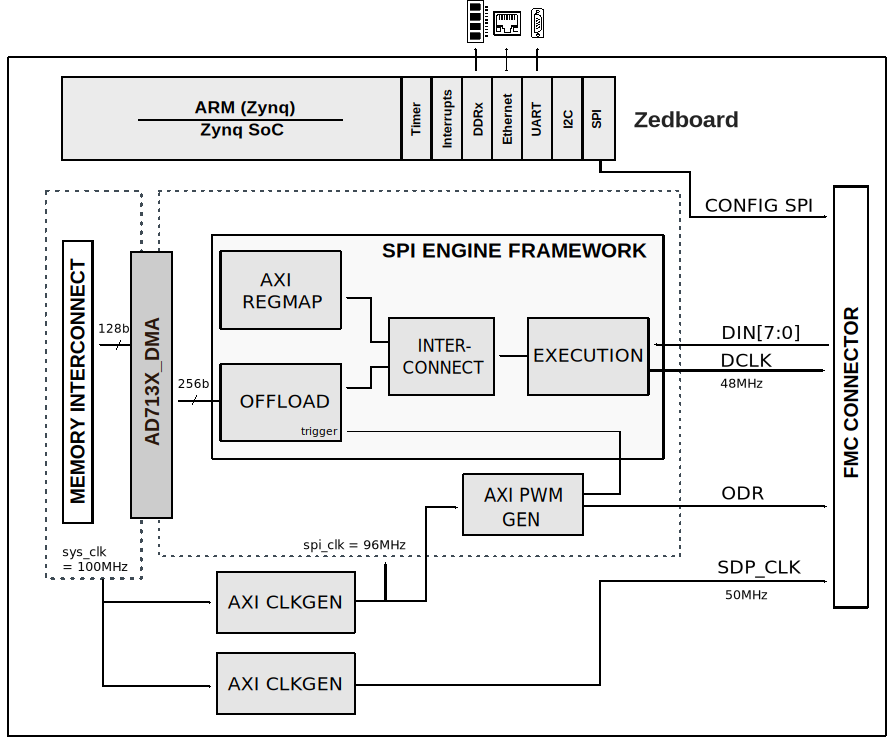

.. _ad7134-fmc:

AD7134-FMC User Guide
=====================

Introduction
------------

The :adi:`AD7134` is a quad channel, 24-bit, low noise, simultaneous sampling,
precision analog-to-digital converter (ADC), based on the continuous time
sigma-delta (CTSD) modulation scheme. This architecture inherently provides
alias rejection up to 100 dB, with programmable data rates from 10 SPS to
1.496 MSPS and dynamic range of up to 138 dB when using a sinc3 filter at
10 SPS.

The EVAL-AD7134FMCZ evaluation board provides all the interfaces necessary
to interact with the device using a Xilinx FPGA development board. The design
supports continuous data capture at maximum 1.5 MSPS data rate from both
:adi:`AD7134` devices on the evaluation board.

Supported Devices
-----------------

- :adi:`AD7134`
- :adi:`AD4134`

Supported Carriers
------------------

- `ZedBoard <https://digilent.com/reference/programmable-logic/zedboard/start>`__

Hardware
--------

Evaluation Board
~~~~~~~~~~~~~~~~

- `EVAL-AD7134FMCZ <https://www.analog.com/en/resources/evaluation-hardware-and-software/evaluation-boards-kits/eval-ad7134fmcz.html>`__

Jumper Setup
~~~~~~~~~~~~

.. list-table::
   :header-rows: 1

   * - Jumper/Solder Link
     - Position
     - Description
   * - JP14
     - Mounted
     - DEC0/DCLKIO
   * - JP15
     - Mounted
     - DEC0/DCLKIO
   * - JP16
     - Mounted
     - MODE
   * - JP17
     - Mounted
     - MODE

HDL Reference Design
--------------------

The HDL reference design uses the
`SPI Engine Framework <https://analogdevicesinc.github.io/hdl/library/spi_engine/index.html>`__
to interface with the two :adi:`AD7134` ADCs. The design only supports the
slave mode for both devices with both DCLK and ODR generated by the FPGA.
Each device sends data on 4 of the 8 DIN bits.

Block Diagram
~~~~~~~~~~~~~

   AD7134-FMC HDL block diagram

HDL Source Code
~~~~~~~~~~~~~~~

- :git-hdl:`projects/ad7134_fmc`

HDL Documentation
~~~~~~~~~~~~~~~~~

- `AD7134-FMC HDL project <https://analogdevicesinc.github.io/hdl/projects/ad7134_fmc/index.html>`__

Building the HDL Project
~~~~~~~~~~~~~~~~~~~~~~~~

The design is built upon ADI's generic HDL reference design framework. ADI
does not distribute pre-built bitstream files, so the project must be built
from source. Clone the HDL repository and, with the correct tools installed,
navigate to the project directory and run ``make``:

.. code-block:: bash

   cd hdl/projects/ad7134_fmc/zed
   make

A comprehensive build guide is available in the
`HDL User Guide <https://analogdevicesinc.github.io/hdl/user_guide/introduction.html>`__.

Software Support
----------------

Linux Device Driver
~~~~~~~~~~~~~~~~~~~

Driver and device tree source files:

- :git-linux:`drivers/iio/adc/ad4134.c`
- :git-linux:`arch/arm/boot/dts/xilinx/zynq-zed-adv7511-ad4134.dts`

No-OS Driver
~~~~~~~~~~~~~

The AD713x No-OS driver provides a platform-independent software layer for
controlling the :adi:`AD7134`/:adi:`AD4134` ADCs from bare-metal applications.

Source code:

- :git-no-OS:`drivers/adc/ad713x`
- :git-no-OS:`projects/ad713x_fmcz`

More Information
----------------

- `ADI Reference Designs HDL User Guide <https://analogdevicesinc.github.io/hdl/user_guide/introduction.html>`__
- `SPI Engine Framework <https://analogdevicesinc.github.io/hdl/library/spi_engine/index.html>`__
- :adi:`AD7134 Product Page <AD7134>`
- :adi:`AD4134 Product Page <AD4134>`

Support
-------

Analog Devices will provide limited online support for anyone using the
reference design with Analog Devices components via the
:ez:`FPGA Reference Designs Forum <fpga>`.
