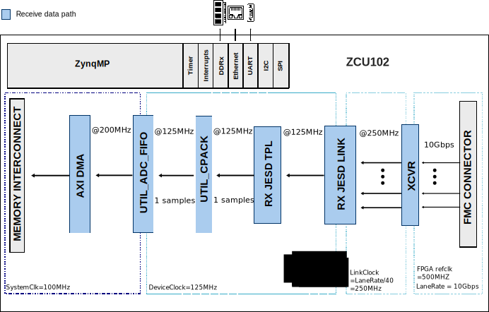
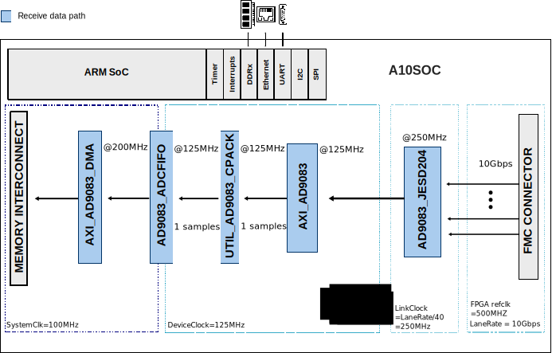
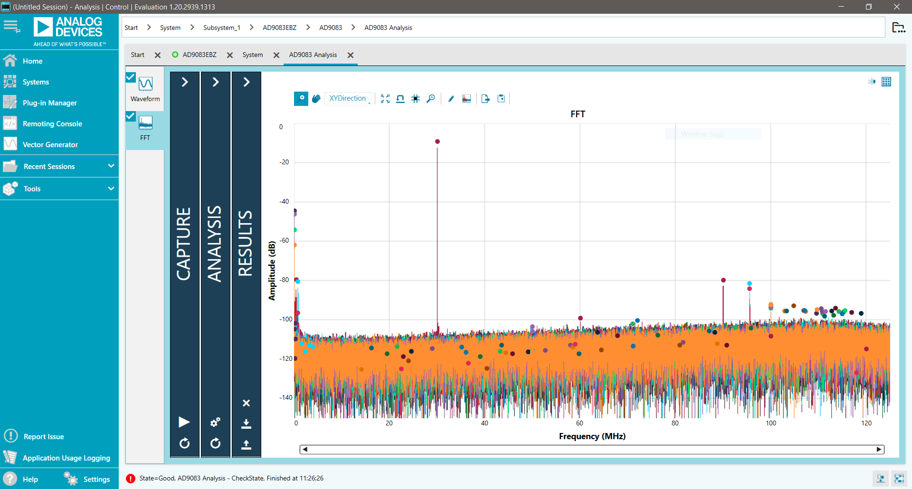
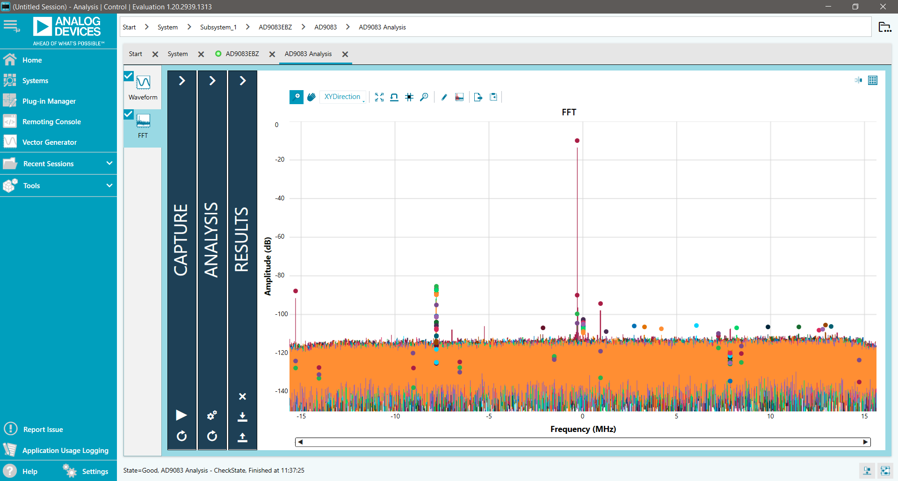
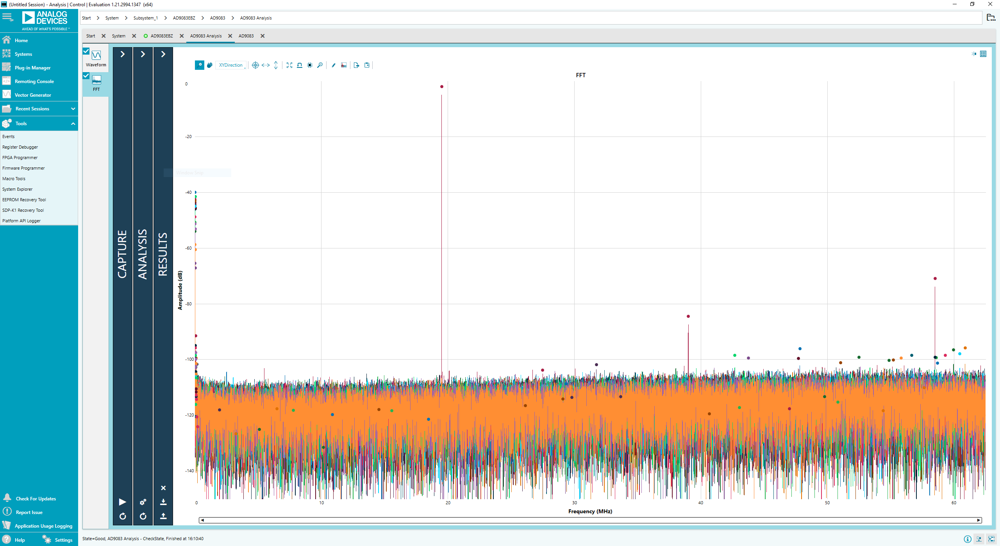

.. _ad9083-evb:

AD9083-EVB User Guide
=====================

Introduction
------------

The :adi:`AD9083` is a 16-bit, 16-channel with 125 MHz bandwidth per channel
(2 GSPS total) analog-to-digital converter (ADC) featuring an on-chip
programmable, single-pole antialiasing filter and termination resistor that is
designed for low power, small size, and ease of use.

The dual ADC cores feature a multistage, differential pipelined architecture
with integrated output error correction logic. Each ADC features wide
bandwidth inputs supporting a variety of user-selectable input ranges.

Supported Devices
-----------------

- :adi:`AD9083`

Supported Carriers
------------------

.. list-table::
   :header-rows: 1

   * - Board
     - HDL
     - Linux
   * - :xilinx:`ZCU102 <products/boards-and-kits/ek-u1-zcu102-g.html>`
     - Yes
     - Yes
   * - :intel:`Arria 10 SoC
       <content/www/us/en/products/details/fpga/development-kits/arria/10-sx.html>`
     - Yes
     - Yes

HDL Reference Design
--------------------

The AD9083_EVB reference design is a processor-based embedded system. The
design consists of a receive chain that transports captured samples from the
ADC to the system memory (DDR). Before transferring the data to DDR, the
samples are stored in a buffer implemented on block RAMs from the FPGA fabric.

The link operates with the following parameters:

- Deframer: L=4, M=16, F=8, S=1, N'=16
- JESD204B Lane Rate: 10 Gbps
- ADC Clock: 2000 MHz
- JESD204B Subclass 0

Block Diagrams
~~~~~~~~~~~~~~

   Xilinx block diagram

   Intel block diagram

HDL Source Code
~~~~~~~~~~~~~~~

- :git-hdl:`projects/ad9083_evb`

Software Support
----------------

Linux Driver
~~~~~~~~~~~~

The :adi:`AD9083` is a 16-channel, 125 MHz bandwidth, continuous time
sigma-delta (CTSD) ADC. The 16 ADC cores feature a first-order CTSD modulator
architecture with integrated background nonlinearity correction logic and
self-cancelling dither. Each ADC has a signal processing tile containing a
cascaded integrator comb (CIC) filter, a quadrature digital downconverter
(DDC) with multiple FIR decimation filters, or up to three quadrature DDC
channels with averaging decimation filters for data gating applications.

Users can configure the Subclass 1 JESD204B based high-speed serialized
output in a variety of lane configurations (up to four), depending on the DDC
configuration and the acceptable lane rate of the receiving logic device.

The AD9083 Linux IIO driver depends on **SPI**.

Kernel configuration (``make menuconfig``):

.. code-block:: none

   Device Drivers  --->
     <*> Industrial I/O support --->
       --- Industrial I/O support
       -*-   Enable ring buffer support within IIO
       -*-     Industrial I/O lock free software ring
       -*-   Enable triggered sampling support

             *** Direct Digital Synthesis ***
         [--snip--]

         <*>   Analog Devices CoreFPGA AXI DDS driver
         <*>   Analog Devices AD9083 16-Channel, 125 MHz Bandwidth, JESD204B ADC

         [--snip--]

Driver and device tree source files:

- :git-linux:`drivers/iio/adc/ad9083.c`
- :git-linux:`drivers/iio/adc/ad9083` (API driver)
- :git-linux:`arch/arm64/boot/dts/xilinx/adi-ad9083-fmc-ebz.dtsi`
- :git-linux:`arch/arm64/boot/dts/xilinx/zynqmp-zcu102-rev10-ad9083-fmc-ebz.dts`

Related driver files:

- :git-linux:`drivers/iio/adc/cf_axi_adc_core.c`
- :git-linux:`drivers/iio/adc/cf_axi_adc.h`

No-OS Project
~~~~~~~~~~~~~

- :git-no-OS:`projects/ad9083`

Evaluation Using the ADS8-V3EBZ Capture Board
----------------------------------------------

The AD9083EBZ evaluation board is evaluated using the ADS8-V3EBZ FPGA-based
data capture board and the
:adi:`ACE <design-center/evaluation-hardware-and-software/ace-software.html>`
software.

.. figure:: AD9083EBZ-ADS8-V3EBZTOP-ethernet.jpg
   :align: center

   AD9083EBZ evaluation board and ADS8-V3EBZ data capture board

Equipment Needed
~~~~~~~~~~~~~~~~

**Hardware**

- AD9083EBZ evaluation board
- ADS8-V3EBZ high-speed carrier card
- High quality analog signal source
- Bandpass filter for the analog signal source
- PC running Windows with admin privileges and an available Ethernet and USB
  port

.. note::

   The AD9083 PLL reference clock, FPGA reference clock, and FPGA global
   clock are provided by the on-board :adi:`AD9528` JESD204B clock generator.

**Software**

- :adi:`ACE <design-center/evaluation-hardware-and-software/ace-software.html>`

**Helpful Documents**

- :adi:`AD9083 Data Sheet <AD9083>`
- `ACE User Manual <https://swdownloads.analog.com/ACE/ACE_User_Manual_rev3.pdf>`__
- :adi:`AN-835: Understanding High Speed ADC Testing and Evaluation <media/en/technical-documentation/application-notes/AN-835.pdf>`

Board Design and Integration Files
~~~~~~~~~~~~~~~~~~~~~~~~~~~~~~~~~~~

- Schematics: ``02_059760b.pdf``
- Layout files: ``ad9083ebz_revc.zip``
- Bill of materials: ``05-059760-01-c.zip``

These files can be obtained by contacting
:adi:`Analog Devices Sales <en/about-adi/landing-pages/001/contact-us-sales-support.html>`.

MicroZed Setup
~~~~~~~~~~~~~~

Before evaluating the AD9083, the Ethernet interface to the MicroZed board on
the ADS8-V3EBZ must be configured.

**MicroSD Card Installation**

1. Locate the microSD card labeled ``ADS8-HSx`` from the ADS8-V3EBZ packaging.
2. Connect the microSD card to the MicroZed board (contacts facing up).
3. Verify that the MicroZed board is seated properly on the ADS8-V3EBZ.

.. figure:: sd-card-location.jpg
   :align: center

   MicroSD card slot on the MicroZed board

**Network Interface Configuration**

1. Ensure the connections to the ADS8-V3EBZ are as shown in the setup figure
   above. It is not necessary to connect the AD9083EBZ evaluation board at this
   stage.
2. Connect one end of an Ethernet cable directly to the PC Ethernet port (or a
   USB-to-Ethernet adapter) and the other end to the MicroZed board.
3. Power on the ADS8-V3EBZ board. Allow up to 10 seconds for the MicroZed
   board to boot.
4. Open the local area connection settings:

   - **Windows 7**: Start Menu > Control Panel > Network and Sharing Center >
     Change adapter settings
   - **Windows 10**: Start Menu > Settings > Network & Internet > Change
     adapter options

5. If the Local Area Connection icon does not appear, disconnect and
   reconnect the Ethernet cable to the MicroZed board.
6. Double-click the Local Area Connection icon.
7. Click **Properties**, select **Internet Protocol Version 4 (TCP/IPv4)**,
   and click **Properties**.
8. Enter ``192.168.0.1`` in the IP address field and ensure the subnet mask
   is ``255.255.255.0``.
9. Click **OK**.

ACE Plugin Installation
~~~~~~~~~~~~~~~~~~~~~~~

Download and install the ACE software from the
:adi:`ACE web page <design-center/evaluation-hardware-and-software/ace-software.html>`.
After installation, install the AD9083 evaluation board plugin using one of
the following methods.

**Installation from ACE**

1. Open ACE from the Start menu: All Programs > Analog Devices > ACE.
2. In the left pane, click **Plug-in Manager** to open the Manage Plug-ins
   window.
3. Click the **Available Packages** dropdown menu.
4. Enter ``AD9083`` in the search bar to find the appropriate board plugin.
5. Select the AD9083 plugin and click **Install Selected**.
6. Click **Close**.

.. figure:: manage_plugins.png
   :align: center

   ACE Manage Plug-ins window

**Installation from the Web**

1. Ensure that the ACE software is installed.
2. On the
   :adi:`ACE web page <design-center/evaluation-hardware-and-software/ace-software.html>`,
   navigate to the ACE Evaluation Board Plug-ins section and search for
   ``AD9083``.
3. Click the AD9083 board plugin to download it.

   .. note::

      If using Internet Explorer, the downloaded file extension may be
      ``.zip``. Right-click the file and rename the extension to ``.acezip``.

4. Double-click the ``.acezip`` file to automatically install the plugin.
5. Close ACE after the plugin installation completes.

AD9083 Plugin Overview
~~~~~~~~~~~~~~~~~~~~~~

The AD9083 plugin allows the user to evaluate the :adi:`AD9083` via the
AD9083EBZ evaluation board. The AD9083EBZ provides the power and clocking
necessary to evaluate the 16-channel ADC. The power delivery network is
powered by a :adi:`LTM8074` 1.2A Silent Switcher uModule Regulator, and
clocking is provided by an :adi:`AD9528` JESD204B clock generator with an
on-board 100 MHz VCXO reference.

The plugin configures the AD9083 using the API. Commands are generated by the
plugin, downloaded to the MicroZed, which in turn configures the AD9083. The
plugin also configures the AD9528 using the clocking requirements from the
Startup Wizard.

To begin, ensure the board is connected as shown in the setup figure and that
the ADS8-V3EBZ board is powered on before opening ACE. The plugin appears in
the **Attached Hardware** section of the ACE GUI.

.. figure:: attached-hardware.png
   :align: center

   AD9083EBZ in the ACE Attached Hardware section

**Board View**

Double-clicking the board icon in the Attached Hardware section opens the
AD9083EBZ board view. The board view enables quick setup of the AD9083 using
the **STARTUP WIZARD** pane. It may take several moments for the board view to
initialize.

.. figure:: ad9083_-_2_narrow_bw_mode_startup_wizzard.png
   :align: center

   AD9083EBZ board view with Startup Wizard

**Chip View**

Double-clicking the AD9083 icon in the board view opens the chip view. The
chip view enables customization of the AD9083 beyond the functions available
in the board view.

.. figure:: ad9083_-_4_narrow_bw_mode_ad9083.png
   :align: center

   AD9083 chip view

Evaluation Examples
~~~~~~~~~~~~~~~~~~~

The AD9083 can be configured in many different modes. The following sections
provide examples of several configurations.

Wide Bandwidth Real Output Mode
^^^^^^^^^^^^^^^^^^^^^^^^^^^^^^^

.. list-table::
   :header-rows: 1
   :widths: 50 50

   * - Parameter
     - Value
   * - Sample rate
     - 2 GSPS
   * - On-chip PLL reference
     - 250 MHz (from on-board AD9528)
   * - fINMAX
     - 100 MHz (sample rate / 20)
   * - fC
     - 800 MHz
   * - VMAX
     - 2.0 V
   * - RTERM
     - 100 Ohm
   * - EN_HP
     - 0
   * - Backoff
     - 0
   * - CIC decimator
     - Bypass
   * - Use mixer
     - No
   * - Decimate by J
     - 8
   * - Transport (L, M, F, S, N', K)
     - 4, 16, 6, 1, 12, 32
   * - Lane configuration
     - 4 lanes at 15 Gbps each

To run this configuration:

1. Configure the AD9083 and AD9528 using the AD9083EBZ Startup Wizard with
   the parameters listed above.
2. Click **Apply**. Allow several moments for the configuration to complete.
3. Navigate to **Analysis**.
4. Click **Run Once**.

   AD9083EBZ Wide Bandwidth Real Output Mode typical FFT

Narrow Bandwidth Complex Output Mode
^^^^^^^^^^^^^^^^^^^^^^^^^^^^^^^^^^^^^

This configuration is suitable for applications such as phased-array radar.
The output bandwidth is +/- 12.7187 MHz. This example uses an analog input
frequency of 70.5 MHz and an NCO frequency of 70.3125 MHz.

.. list-table::
   :header-rows: 1
   :widths: 50 50

   * - Parameter
     - Value
   * - Sample rate
     - 2 GSPS
   * - On-chip PLL reference
     - 250 MHz (from on-board AD9528)
   * - fINMAX
     - 100 MHz (sample rate / 20)
   * - fC
     - 800 MHz
   * - VMAX
     - 2.0 V
   * - RTERM
     - 100 Ohm
   * - EN_HP
     - 0
   * - Backoff
     - 0
   * - NCO0/mixer (complex data), FTW
     - 70.3125 MHz
   * - CIC decimator
     - 4
   * - Decimate by J
     - 16
   * - Transport (L, M, F, S, N', K)
     - 2, 32, 32, 1, 16, 32
   * - Lane configuration
     - 2 lanes at 10 Gbps each

To run this configuration:

1. Configure the AD9083 and AD9528 using the AD9083EBZ Startup Wizard with
   the parameters listed above.
2. Click **Apply**. Allow several moments for the configuration to complete.
3. Navigate to **Analysis**.
4. Click **Run Once**.

   AD9083EBZ Narrow Bandwidth Complex Output Mode typical FFT

Precision Time Domain Mode
^^^^^^^^^^^^^^^^^^^^^^^^^^

.. list-table::
   :header-rows: 1
   :widths: 50 50

   * - Parameter
     - Value
   * - Sample rate
     - 1 GSPS
   * - On-chip PLL reference
     - 125 MHz (from on-board AD9528)
   * - VMAX
     - 1.8 V
   * - RTERM
     - 100 Ohm
   * - fC
     - 800 MHz
   * - High Performance Mode
     - False
   * - Fin Max
     - 50 MHz (sample rate / 20)
   * - Backoff
     - 0
   * - ADC Channels
     - 16
   * - Bypass CIC
     - False
   * - CIC decimator
     - 8
   * - Use Mixer
     - False
   * - Decimate by J
     - Bypass (Decimate by 1)
   * - jtx_subclasv_cfg
     - 0
   * - Lanes (L)
     - 3
   * - Virtual Converters (M)
     - 16
   * - Octets/Frame per Lane (F)
     - 8
   * - Bits Packed (NP)
     - 12
   * - Resolution Bits (N)
     - 12
   * - Frames in a multi-frame (K)
     - 32
   * - Lane configuration
     - 3 lanes at 10 Gbps each

To run this configuration:

1. Configure the AD9083 and AD9528 using the AD9083EBZ Startup Wizard with
   the parameters listed above.
2. Click **Apply**. Allow several moments for the configuration to complete.
3. Navigate to **Analysis**.
4. Click **Run Once**.

   AD9083EBZ Precision Time Domain Mode typical FFT

External Trigger
~~~~~~~~~~~~~~~~

SMA connector J2 on the ADS8-V3EBZ can be used as an optional trigger to
control the data capture start time. The trigger requires a 1.8 V active-high
pulse width longer than one period of the FPGA internal peripheral clock
(50 MHz).

To enable the external trigger:

1. Click **Navigate to FPGA SPI** on the block diagram of the AD9083 chip
   view.

   .. image:: navigate_to_fpga_spi.png
      :align: center

2. Click the **+** sign next to Address (Hex) ``0x0106``.

   .. image:: 0106.png
      :align: center

3. Click the **0** on the same row as ``ext_trig_en``. The value changes
   to **1**.

   .. image:: ext_trig_en.png
      :align: center

4. Click **Apply Changes**.

   .. image:: apply_changes.png
      :align: center

SMA connector J3 is normally used as a system ready indicator, signaling that
the FPGA is ready to accept an external trigger. To capture data, click
**Run Once** as normal. Capture begins when a 1.8 V pulse is detected on
connector J2 of the ADS8-V3EBZ.

Troubleshooting
~~~~~~~~~~~~~~~

Board Not Functioning Properly
^^^^^^^^^^^^^^^^^^^^^^^^^^^^^^

A board component may have been rendered inoperable by ESD, removing a jumper
during powered operation, accidental shorting while probing, or similar causes.
Check the supply domain voltages on the power adapter board while powered:

.. list-table::
   :header-rows: 1

   * - Domain
     - Test Point
     - Approx. Voltage
   * - 12V_IN
     - TP19
     - 12 V
   * - V1P0V
     - TP6
     - 1.0 V
   * - V1P8V
     - TP14
     - 1.8 V

No SPI Communication with ADS8-V3EBZ
^^^^^^^^^^^^^^^^^^^^^^^^^^^^^^^^^^^^^

- Ensure the USB cable has a good connection on both the ADS8-V3EBZ board and
  the PC. Try another USB port if needed; some PCs work best with a USB 3.0
  port.
- The ADS8-V3EBZ should appear in the PC Device Manager.
- Verify that the FPGA on the ADS8-V3EBZ has been programmed. A lit
  ``FPGA_DONE`` LED (DS15) on the top of the ADS8-V3EBZ and a powered fan are
  good indicators.
- Check the common-mode voltage on the JESD204B traces. On the evaluation
  board, the common-mode voltage should be approximately 0.5 V. On the
  ADS8-V3EBZ, it should be around 0.8 V.
- To test SPI operation, read and write to register ``0x000A`` (Scratch Pad
  Register) using the ACE Register Debugger. If the register reads back the
  same value written to it, SPI is operational.

  - All registers reading back as ``0xFF`` or ``0x00`` may indicate no SPI
    communication.
  - Register ``0x0000`` (SPI Configuration A) reading back ``0x81`` may
    indicate the FPGA on the ADS8-V3EBZ has not been programmed.

Board Fails to Capture Data
^^^^^^^^^^^^^^^^^^^^^^^^^^^^

- Ensure the board is functioning properly and SPI communication is
  successful (see previous troubleshooting tips).
- Check the signal generator input on connector J20. Using SPI, read the
  on-chip PLL Lock Detect register ``0xD44`` to verify the PLL is locked.
  Place a differential oscilloscope probe on the clock pins to confirm the
  clock signal reaches the chip.
- Check the JESD204B PLL Locked indicator or register ``0x301F`` (PLL
  Status). If the indicator in the plugin chip view is green, or if the
  register reads back ``0x80``, the PLL is locked. If it is not locked:

  - Restart the evaluation board setup (power-cycle the FPGA, start a new
    session in ACE) by following the instructions from the beginning.
  - Ensure that P3 (Power Down / Standby jumper) is not jumped.

More Information
----------------

- `ADI Reference Designs HDL User Guide <https://analogdevicesinc.github.io/hdl/user_guide/introduction.html>`__
- `JESD204B High-Speed Serial Interface Support <https://analogdevicesinc.github.io/hdl/library/jesd204/index.html>`__

Support
-------

Analog Devices will provide limited online support for anyone using the
reference design with Analog Devices components via the
:ez:`FPGA Reference Designs Forum <fpga>`.
