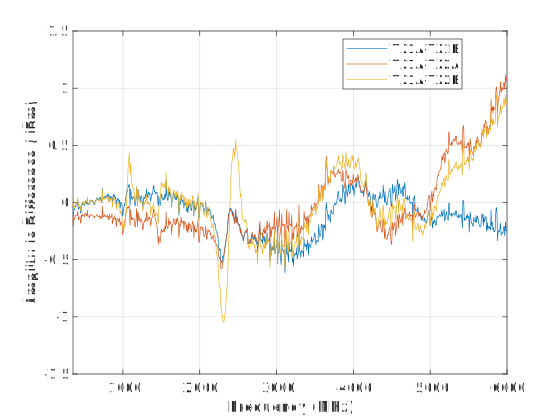
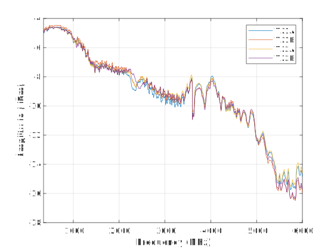
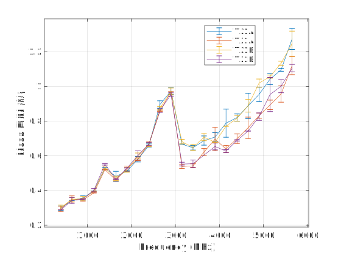

.. _adrv9009-zu11eg performance:

Performance Characteristics
============================

Testing was conducted using an Agilent N9030A PXA spectrum analyzer.

   Amplitude variation across transmit channels over frequency

   Transmit power over frequency for CW 40 MHz off LO

   Transmit EVM of LTE10 over frequency without environmental shielding
