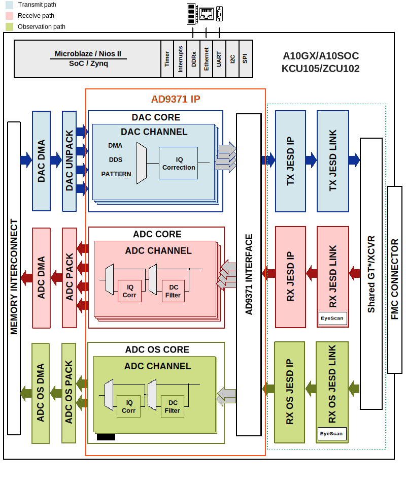

.. _adrv9371x:

ADRV9371x User Guide
=====================

Introduction
------------

The HDL reference design for the :adi:`ADRV9371` is an embedded system built
around a processor core (ARM, NIOS-II, or Microblaze). The device digital
interface is handled by the transceiver IP followed by the JESD204B and device
specific cores. The JESD204B lanes are shared among the 4 transmit, 4 receive,
and 2 observation/sniffer receive data paths by the same set of transceivers
within the IP. The cores are programmable through an AXI-Lite interface. The
delineated data is then passed on to independent DMA cores for the transmit,
receive, and observation/sniffer paths.

The digital interface consists of 4 transmit, 2 receive, and 2
observation/sniffer lanes running up to 6 Gbps (default is 4 Gbps). The DAC
data may be sourced from an internal data generator (DDS, pattern, or PRBS) or
from the external DDR via DMA. The ADC data is sent to the DDR via DMA.

Supported Devices
-----------------

- :adi:`AD9371`

Supported Carriers
------------------

.. list-table::
   :header-rows: 1

   * - Board
     - HDL
     - Linux
   * - :intel:`Arria 10 SoC
       <content/www/us/en/products/details/fpga/development-kits/arria/10-sx.html>`
     - Yes
     - Yes
   * - :xilinx:`KCU105 <products/boards-and-kits/kcu105.html>`
     - Yes
     - Yes
   * - :xilinx:`ZC706 <products/boards-and-kits/ek-z7-zc706-g.html>`
     - Yes
     - Yes
   * - :xilinx:`ZCU102 <products/boards-and-kits/ek-u1-zcu102-g.html>`
     - Yes
     - Yes

JESD204B Interface
------------------

The AD9371 uses a JESD204B serial interface to the FPGA. The default
configuration uses a 4.9152 Gbps lane rate with a 122.88 MHz link clock.

.. list-table::
   :header-rows: 1

   * - Path
     - Lanes
     - Lane Rate
   * - TX
     - 4
     - 4.9152 Gbps
   * - RX
     - 2
     - 4.9152 Gbps
   * - Observation RX
     - 2
     - 4.9152 Gbps

Arria 10 SoC Notes
~~~~~~~~~~~~~~~~~~~

.. warning::

   The Arria 10 SoC Development Kit (Rev C or later) requires an FMC pin
   rework: move 4 zero-ohm resistors (R612 to R610, R613 to R611, R621 to
   R620, R633 to R632) to route FMC pins directly from the FPGA instead of
   the clock chip.

The Altera ADXCVR transceivers require re-calibration after the :adi:`AD9528`
clock chip is configured (software-driven, post-FPGA configuration).

HDL Reference Design
--------------------

Block Diagram
~~~~~~~~~~~~~

   ADRV9371x block diagram

HDL Source Code
~~~~~~~~~~~~~~~

- :git-hdl:`projects/adrv9371x`

Quick Start Guide
-----------------

Hardware Requirements
~~~~~~~~~~~~~~~~~~~~~

- FPGA carrier board (see supported carriers table above)
- :adi:`EVAL-ADRV9371 <EVAL-ADRV9371>` FMC board
- 2 x SMA cable for analog signal loopback (optional, but recommended)
- Power supply for the carrier board
- Micro-USB cable for serial console
- Ethernet cable for network connectivity
- SD card with latest ADI Linux image (for Arria 10 SoC)

Software Requirements
~~~~~~~~~~~~~~~~~~~~~

- Intel Quartus 21.2 or later (for Intel carriers) / Xilinx Vivado (for
  Xilinx carriers)
- UART terminal (e.g. PuTTY, TeraTerm), baud rate 115200
- :doc:`IIO Oscilloscope </software/iio-oscilloscope/index>`

Hardware Setup (Arria 10 SoC)
~~~~~~~~~~~~~~~~~~~~~~~~~~~~~

1. Insert the EVAL-ADRV9371 board into the **FMC A** (J29) header of the
   Arria 10 SoC Development Kit.
2. Ensure both the HPS (J26) and FPGA (J27) memory modules are installed.
3. Connect an Ethernet cable to the right-most Ethernet port (J5).
4. Connect a USB cable to UART1 (J10) for serial console access.
5. Insert the microSD card with the ADI Linux image into the microSD card
   slot.
6. All jumpers and switches on the board should be in the default position
   for SD card boot.
7. Connect the power supply and turn on the board.

Preparing the SD Card (Arria 10 SoC)
~~~~~~~~~~~~~~~~~~~~~~~~~~~~~~~~~~~~~

1. Download the `ADI Kuiper Linux <https://wiki.analog.com/resources/tools-software/linux-software/kuiper-linux>`__
   image and flash it to an SD card.
2. Copy the boot files from the ``socfpga_arria10_socdk_adrv9371`` directory
   to the SD card BOOT partition:

   - ``fit_spl_fpga.itb``
   - ``socfpga_arria10_socdk_sdmmc.dtb``
   - ``u-boot.img``
   - ``zImage`` (from the ``socfpga_arria10-common`` folder)
   - ``extlinux.conf`` in the ``extlinux`` folder

3. Write ``u-boot-splx4.sfp`` from the same folder to the third SD card
   partition.

Verifying Operation
~~~~~~~~~~~~~~~~~~~

Once the system boots, run the following command to verify the
EVAL-ADRV9371 devices are detected:

.. code-block:: bash

   iio_info | grep iio:device

Expected output:

.. code-block:: text

   iio:device0: 0-0014
   iio:device1: 0-0016
   iio:device2: ad9528-1
   iio:device3: ad9371-phy
   iio:device4: axi-ad9371-rx-obs-hpc (buffer capable)
   iio:device5: axi-ad9371-tx-hpc (buffer capable)
   iio:device6: axi-ad9371-rx-hpc (buffer capable)

Using IIO Oscilloscope
~~~~~~~~~~~~~~~~~~~~~~

The :doc:`IIO Oscilloscope </software/iio-oscilloscope/index>` application
can be used remotely for device control, monitoring, and data capture.

1. Determine the board IP address from the serial console using
   ``ifconfig eth0``, or check the LCD display if connected to a DHCP
   network.
2. On the host PC, launch IIO Oscilloscope and go to **Settings > Connect**.
3. Select **Manual** and enter the URI: ``ip:<board_ip_address>``.
4. Click **Refresh**, then **Connect**.
5. To plot captured waveforms, go to **File > New Plot**, select the
   desired channels, and click **Capture / Stop**.

Software Support
----------------

Linux Device Driver
~~~~~~~~~~~~~~~~~~~

- :git-linux:`AD9371 Linux Driver <drivers/iio/adc/ad9371.c>`
- :adi:`AD9528` clock chip driver
- JESD204B RX/TX drivers
- AXI-ADXCVR high-speed transceiver drivers

Device Trees
~~~~~~~~~~~~

Xilinx:

- :git-linux:`arch/arm/boot/dts/xilinx/zynq-zc706-adv7511-adrv9371.dts`
- :git-linux:`arch/arm64/boot/dts/xilinx/zynqmp-zcu102-rev10-adrv9371.dts`

Intel:

- :git-linux:`arch/arm/boot/dts/intel/socfpga/socfpga_arria10_socdk_adrv9371.dts`

More Information
----------------

- `ADI Reference Designs HDL User Guide <https://analogdevicesinc.github.io/hdl/user_guide/introduction.html>`__
- `JESD204B High-Speed Serial Interface Support <https://analogdevicesinc.github.io/hdl/library/jesd204/index.html>`__
- :adi:`AD9371 Product Page <AD9371>`

Support
-------

Analog Devices will provide limited online support for anyone using the
reference design with Analog Devices components via the
:ez:`FPGA Reference Designs Forum <fpga>`.
