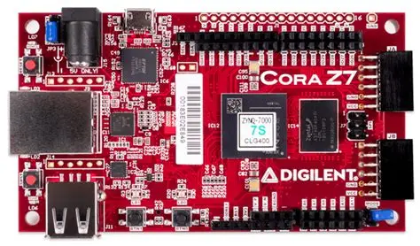

.. _eval-ad469x-quickstart-coraz7s:

CoraZ7-07S Quickstart
===============================================================================

This guide provides quick instructions on how to set up the
:adi:`EVAL-AD4692-ARDZ` on:

- `Cora Z7S <https://digilent.com/shop/cora-z7-zynq-7000-single-core-for-arm-fpga-soc-development>`__
  on Arduino shield connector

.. esd-warning::

Using Linux as software
-------------------------------------------------------------------------------

Necessary files
~~~~~~~~~~~~~~~~~~~~~~~~~~~~~~~~~~~~~~~~~~~~~~~~~~~~~~~~~~~~~~~~~~~~~~~~~~~~~~~

.. note::

  The SD card includes several folders in the root directory of the BOOT
  partition. In order to configure the SD card to work with a specific
  FPGA board and ADI hardware, several files must be copied onto the
  root directory. Using the host PC, drag and drop the required files
  onto the BOOT partition, and use the EJECT function when removing the
  SD card from the reader.

The following files are needed for the system to boot:

  - HDL boot image: ``BOOT.BIN``
  - Linux Kernel image: ``uImage``
  - Linux device tree: ``devicetree.dtb``

They can either be taken from the SD card -- already generated by us,
or you can build them manually:

  - Instructions on how to choose the boot files from the SD card can
    be found in the **Platform-Specific Manual Steps** section from
    here :external+kuiper:ref:`hardware-configuration`.
  - Instructions on how to manually build the boot files from source
    can be found here:

    - :ref:`linux-kernel zynq`
    - :external+hdl:ref:`ad469x_evb` build documentation. More HDL
      build details at :external+hdl:ref:`build_hdl`.

.. important::

   Some projects provide multiple devicetree files in the SD card's
   boot folders. Make sure you select the devicetree that matches your
   specific use case.

Required software
~~~~~~~~~~~~~~~~~~~~~~~~~~~~~~~~~~~~~~~~~~~~~~~~~~~~~~~~~~~~~~~~~~~~~~~~~~~~~~~

- SD Card 16 GB imaged with :external+kuiper:doc:`Kuiper <index>`
- A UART terminal (Putty/Tera Term/Minicom, etc.) with baud rate
  115200 (8N1)

Required hardware
~~~~~~~~~~~~~~~~~~~~~~~~~~~~~~~~~~~~~~~~~~~~~~~~~~~~~~~~~~~~~~~~~~~~~~~~~~~~~~~

- `Cora Z7S <https://digilent.com/shop/cora-z7-zynq-7000-single-core-for-arm-fpga-soc-development>`__
  FPGA board
- :adi:`EVAL-AD4692-ARDZ` evaluation board
- Class 10 16 GB SD Card
- Micro-USB cable (UART / Power)
- Ethernet cable

More details as to why you need these, can be found at
:ref:`eval-ad469x-prerequisites`.

Testing
~~~~~~~~~~~~~~~~~~~~~~~~~~~~~~~~~~~~~~~~~~~~~~~~~~~~~~~~~~~~~~~~~~~~~~~~~~~~~~~

Creating the setup
^^^^^^^^^^^^^^^^^^^^^^^^^^^^^^^^^^^^^^^^^^^^^^^^^^^^^^^^^^^^^^^^^^^^^^^^^^^^^^^

.. image:: ../images/ad4692_coraz7s_setup_top.jpg
   :width: 900

#. Get the `Cora Z7S <https://digilent.com/shop/cora-z7-zynq-7000-single-core-for-arm-fpga-soc-development>`__
#. Configure CoraZ7-07S jumpers:

   .. figure:: ../../images/cora_hw_config.jpg
      :align: center
      :width: 500

      CoraZ7-07S jumper configuration.

   .. list-table::
      :header-rows: 1
      :widths: 20 60 20

      * - Jumper Location
        - Description
        - Shunt Placement
      * - JP2
        - Selects how the CoraZ7-07S board boots. We want to boot
          from the microSD card.
        - Across Pins 1 and 2
      * - JP3
        - Selects how the CoraZ7-07S board is powered. We are
          powering from the USB port.
        - Across Pins 3 and 2 (labeled USB)

#. Prepare the SD card:

   #. Validate, Format, and Flash the SD Card following the
      :external+kuiper:doc:`Use Kuiper Image <use-kuiper-image>`
      guide.

#. Insert the microSD card into the CoraZ7-07S card slot.
#. Plug-in an Ethernet cable from your router/switch to the Ethernet
   port on the FPGA board.
#. Connect the :adi:`EVAL-AD4692-ARDZ` to the Arduino shield connector.
#. Connect the UART port of CoraZ7-07S to a PC via Micro-USB cable.
#. Power up the setup by plugging the Micro-USB cable into your PC's
   USB port.
#. Observe Kernel and serial console output messages on your terminal.

Boot messages
^^^^^^^^^^^^^^^^^^^^^^^^^^^^^^^^^^^^^^^^^^^^^^^^^^^^^^^^^^^^^^^^^^^^^^^^^^^^^^^

The following is what is printed in the serial console, after you have
connected to the proper ttyUSB or COM port:

.. collapsible:: Complete boot log

  ::

    U-Boot 2018.01-21442-gf06dec3cab (Feb 13 2025 - 17:08:56 +0200), Build: jenkins-development-build_uboot-57

    Model: Zynq Cora Z7 Development Board
    Board: Xilinx Zynq
    Silicon: v3.1
    I2C:   ready
    DRAM:  ECC disabled 512 MiB
    Flash: ## Unknown flash on Bank 1 - Size = 0x00000000 = 0 MB
    0 Bytes
    MMC:   sdhci@e0100000: 0 (SD)
    Using default environment

    In:    serial@e0000000
    Out:   serial@e0000000
    Err:   serial@e0000000
    Net:   ZYNQ GEM: e000b000, phyaddr 1, interface rgmii-id
    eth0: ethernet@e000b000
    reading uEnv.txt
    407 bytes read in 24 ms (15.6 KiB/s)
    Importing environment from SD ...
    Hit any key to stop autoboot:  0
    Device: sdhci@e0100000
    Manufacturer ID: 3
    OEM: 5344
    Name: SD32G
    Tran Speed: 50000000
    Rd Block Len: 512
    SD version 3.0
    High Capacity: Yes
    Capacity: 29.7 GiB
    Bus Width: 4-bit
    Erase Group Size: 512 Bytes
    reading uEnv.txt
    407 bytes read in 23 ms (16.6 KiB/s)
    Loaded environment from uEnv.txt
    Importing environment from SD ...
    Running uenvcmd ...
    Copying Linux from SD to RAM...
    reading uImage
    10267984 bytes read in 595 ms (16.5 MiB/s)
    reading devicetree.dtb
    13224 bytes read in 30 ms (429.7 KiB/s)
    ** Unable to read file uramdisk.image.gz **
    ## Booting kernel from Legacy Image at 03000000 ...
      Image Name:   Linux-6.12.0-27460-gd0e39c3b63d9
      Image Type:   ARM Linux Kernel Image (uncompressed)
      Data Size:    10267920 Bytes = 9.8 MiB
      Load Address: 00008000
      Entry Point:  00008000
      Verifying Checksum ... OK
    ## Flattened Device Tree blob at 02a00000
      Booting using the fdt blob at 0x2a00000
      Loading Kernel Image ... OK
      Loading Device Tree to 1eb18000, end 1eb1e3a7 ... OK

    Starting kernel ...

    Booting Linux on physical CPU 0x0
    Linux version 6.12.0-27460-gd0e39c3b63d9 (tgadalea@HYB-vs9PLV6JDta) (arm-amd-linux-gnueabi-gcc.real (GCC) 13.3.0, GNU ld (GNU Binutils) 2.42.0.20240723) #1 SMP PREEMPT Mon Jun 22 11:44:40 EEST 2026
    CPU: ARMv7 Processor [413fc090] revision 0 (ARMv7), cr=18c5387d
    CPU: PIPT / VIPT nonaliasing data cache, VIPT aliasing instruction cache
    OF: fdt: Machine model: Zynq Cora Z7 Development Board
    earlycon: cdns0 at MMIO 0xe0000000 (options '115200n8')
    printk: legacy bootconsole [cdns0] enabled
    Memory policy: Data cache writealloc
    cma: Reserved 128 MiB at 0x16800000 on node -1
    Zone ranges:
      Normal   [mem 0x0000000000000000-0x000000001fffffff]
      HighMem  empty
    Movable zone start for each node
    Early memory node ranges
      node   0: [mem 0x0000000000000000-0x000000001fffffff]
    Initmem setup node 0 [mem 0x0000000000000000-0x000000001fffffff]
    percpu: Embedded 16 pages/cpu s34828 r8192 d22516 u65536
    Kernel command line: console=ttyPS0,115200 root=/dev/mmcblk0p2 rw earlycon rootfstype=ext4 rootwait clk_ignore_unused cpuidle.off=1
    Dentry cache hash table entries: 65536 (order: 6, 262144 bytes, linear)
    Inode-cache hash table entries: 32768 (order: 5, 131072 bytes, linear)
    Built 1 zonelists, mobility grouping on.  Total pages: 131072
    mem auto-init: stack:all(zero), heap alloc:off, heap free:off
    SLUB: HWalign=64, Order=0-3, MinObjects=0, CPUs=2, Nodes=1
    trace event string verifier disabled
    rcu: Preemptible hierarchical RCU implementation.
    rcu:    RCU event tracing is enabled.
    rcu:    RCU restricting CPUs from NR_CPUS=4 to nr_cpu_ids=2.
            Trampoline variant of Tasks RCU enabled.
    rcu: RCU calculated value of scheduler-enlistment delay is 10 jiffies.
    rcu: Adjusting geometry for rcu_fanout_leaf=16, nr_cpu_ids=2
    RCU Tasks: Setting shift to 1 and lim to 1 rcu_task_cb_adjust=1 rcu_task_cpu_ids=2.
    NR_IRQS: 16, nr_irqs: 16, preallocated irqs: 16
    efuse mapped to (ptrval)
    slcr mapped to (ptrval)
    L2C: platform modifies aux control register: 0x72360000 -> 0x72760000
    L2C: DT/platform modifies aux control register: 0x72360000 -> 0x72760000
    L2C-310 erratum 769419 enabled
    L2C-310 enabling early BRESP for Cortex-A9
    L2C-310 full line of zeros enabled for Cortex-A9
    L2C-310 ID prefetch enabled, offset 1 lines
    L2C-310 dynamic clock gating enabled, standby mode enabled
    L2C-310 cache controller enabled, 8 ways, 512 kB
    L2C-310: CACHE_ID 0x410000c8, AUX_CTRL 0x76760001
    rcu: srcu_init: Setting srcu_struct sizes based on contention.
    zynq_clock_init: clkc starts at (ptrval)
    Zynq clock init
    sched_clock: 64 bits at 163MHz, resolution 6ns, wraps every 4398046511101ns
    clocksource: arm_global_timer: mask: 0xffffffffffffffff max_cycles: 0x257a3bfb55, max_idle_ns: 440795207830 ns
    Switching to timer-based delay loop, resolution 6ns
    Console: colour dummy device 80x30
    Calibrating delay loop (skipped), value calculated using timer frequency.. 325.00 BogoMIPS (lpj=1625000)
    CPU: Testing write buffer coherency: ok
    CPU0: Spectre v2: using BPIALL workaround
    pid_max: default: 32768 minimum: 301
    Mount-cache hash table entries: 1024 (order: 0, 4096 bytes, linear)
    Mountpoint-cache hash table entries: 1024 (order: 0, 4096 bytes, linear)
    CPU0: thread -1, cpu 0, socket 0, mpidr 80000000
    Setting up static identity map for 0x100000 - 0x100060
    rcu: Hierarchical SRCU implementation.
    rcu:    Max phase no-delay instances is 1000.
    smp: Bringing up secondary CPUs ...
    CPU1: failed to boot: -1
    smp: Brought up 1 node, 1 CPU
    SMP: Total of 1 processors activated (325.00 BogoMIPS).
    CPU: All CPU(s) started in SVC mode.
    Memory: 355460K/524288K available (15360K kernel code, 1639K rwdata, 11824K rodata, 1024K init, 515K bss, 36296K reserved, 131072K cma-reserved, 0K highmem)
    devtmpfs: initialized
    VFP support v0.3: implementor 41 architecture 3 part 30 variant 9 rev 4
    clocksource: jiffies: mask: 0xffffffff max_cycles: 0xffffffff, max_idle_ns: 19112604462750000 ns
    futex hash table entries: 512 (order: 3, 32768 bytes, linear)
    pinctrl core: initialized pinctrl subsystem
    NET: Registered PF_NETLINK/PF_ROUTE protocol family
    DMA: preallocated 256 KiB pool for atomic coherent allocations
    thermal_sys: Registered thermal governor 'step_wise'
    platform axi: Fixed dependency cycle(s) with /axi/interrupt-controller@f8f01000
    platform replicator: Fixed dependency cycle(s) with /axi/etb@f8801000
    amba f8801000.etb: Fixed dependency cycle(s) with /replicator
    platform replicator: Fixed dependency cycle(s) with /axi/tpiu@f8803000
    amba f8803000.tpiu: Fixed dependency cycle(s) with /replicator
    platform replicator: Fixed dependency cycle(s) with /axi/funnel@f8804000
    amba f8804000.funnel: Fixed dependency cycle(s) with /axi/ptm@f889d000
    amba f8804000.funnel: Fixed dependency cycle(s) with /axi/ptm@f889c000
    amba f8804000.funnel: Fixed dependency cycle(s) with /replicator
    amba f8804000.funnel: Fixed dependency cycle(s) with /axi/ptm@f889c000
    amba f889c000.ptm: Fixed dependency cycle(s) with /axi/funnel@f8804000
    amba f8804000.funnel: Fixed dependency cycle(s) with /axi/ptm@f889d000
    amba f889d000.ptm: Fixed dependency cycle(s) with /axi/funnel@f8804000
    hw-breakpoint: found 5 (+1 reserved) breakpoint and 1 watchpoint registers.
    hw-breakpoint: maximum watchpoint size is 4 bytes.
    e0000000.serial: ttyPS0 at MMIO 0xe0000000 (irq = 26, base_baud = 6250000) is a xuartps
    printk: legacy console [ttyPS0] enabled
    printk: legacy console [ttyPS0] enabled
    printk: legacy bootconsole [cdns0] disabled
    printk: legacy bootconsole [cdns0] disabled
    SCSI subsystem initialized
    usbcore: registered new interface driver usbfs
    usbcore: registered new interface driver hub
    usbcore: registered new device driver usb
    mc: Linux media interface: v0.10
    videodev: Linux video capture interface: v2.00
    pps_core: LinuxPPS API ver. 1 registered
    pps_core: Software ver. 5.3.6 - Copyright 2005-2007 Rodolfo Giometti <giometti@linux.it>
    PTP clock support registered
    jesd204: found 0 devices and 0 topologies
    FPGA manager framework
    Advanced Linux Sound Architecture Driver Initialized.
    clocksource: Switched to clocksource arm_global_timer
    NET: Registered PF_INET protocol family
    IP idents hash table entries: 8192 (order: 4, 65536 bytes, linear)
    tcp_listen_portaddr_hash hash table entries: 512 (order: 0, 4096 bytes, linear)
    Table-perturb hash table entries: 65536 (order: 6, 262144 bytes, linear)
    TCP established hash table entries: 4096 (order: 2, 16384 bytes, linear)
    TCP bind hash table entries: 4096 (order: 4, 65536 bytes, linear)
    TCP: Hash tables configured (established 4096 bind 4096)
    UDP hash table entries: 256 (order: 1, 8192 bytes, linear)
    UDP-Lite hash table entries: 256 (order: 1, 8192 bytes, linear)
    NET: Registered PF_UNIX/PF_LOCAL protocol family
    RPC: Registered named UNIX socket transport module.
    RPC: Registered udp transport module.
    RPC: Registered tcp transport module.
    RPC: Registered tcp-with-tls transport module.
    RPC: Registered tcp NFSv4.1 backchannel transport module.
    workingset: timestamp_bits=30 max_order=17 bucket_order=0
    NFS: Registering the id_resolver key type
    Key type id_resolver registered
    Key type id_legacy registered
    nfs4filelayout_init: NFSv4 File Layout Driver Registering...
    nfs4flexfilelayout_init: NFSv4 Flexfile Layout Driver Registering...
    fuse: init (API version 7.41)
    io scheduler mq-deadline registered
    io scheduler kyber registered
    io scheduler bfq registered
    zynq-pinctrl 700.pinctrl: zynq pinctrl initialized
    ledtrig-cpu: registered to indicate activity on CPUs
    dma-pl330 f8003000.dma-controller: Loaded driver for PL330 DMAC-241330
    dma-pl330 f8003000.dma-controller:      DBUFF-128x8bytes Num_Chans-8 Num_Peri-4 Num_Events-16
    brd: module loaded
    loop: module loaded
    Registered mathworks_ip class
    MACsec IEEE 802.1AE
    tun: Universal TUN/TAP device driver, 1.6
    macb e000b000.ethernet eth0: Cadence GEM rev 0x00020118 at 0xe000b000 irq 39 (00:0a:35:00:01:22)
    usbcore: registered new interface driver asix
    usbcore: registered new interface driver ax88179_178a
    usbcore: registered new interface driver cdc_ether
    usbcore: registered new interface driver net1080
    usbcore: registered new interface driver cdc_subset
    usbcore: registered new interface driver zaurus
    usbcore: registered new interface driver cdc_ncm
    usbcore: registered new interface driver r8153_ecm
    usbcore: registered new interface driver uas
    usbcore: registered new interface driver usb-storage
    usbcore: registered new interface driver usbserial_generic
    usbserial: USB Serial support registered for generic
    usbcore: registered new interface driver ftdi_sio
    usbserial: USB Serial support registered for FTDI USB Serial Device
    usbcore: registered new interface driver upd78f0730
    usbserial: USB Serial support registered for upd78f0730
    ULPI transceiver vendor/product ID 0x0424/0x0007
    Found SMSC USB3320 ULPI transceiver.
    ULPI integrity check: passed.
    ci_hdrc ci_hdrc.0: EHCI Host Controller
    ci_hdrc ci_hdrc.0: new USB bus registered, assigned bus number 1
    ci_hdrc ci_hdrc.0: USB 2.0 started, EHCI 1.00
    usb usb1: New USB device found, idVendor=1d6b, idProduct=0002, bcdDevice= 6.12
    usb usb1: New USB device strings: Mfr=3, Product=2, SerialNumber=1
    usb usb1: Product: EHCI Host Controller
    usb usb1: Manufacturer: Linux 6.12.0-27460-gd0e39c3b63d9 ehci_hcd
    usb usb1: SerialNumber: ci_hdrc.0
    hub 1-0:1.0: USB hub found
    hub 1-0:1.0: 1 port detected
    i2c_dev: i2c /dev entries driver
    gspca_main: v2.14.0 registered
    usbcore: registered new interface driver uvcvideo
    cdns-wdt f8005000.watchdog: Xilinx Watchdog Timer with timeout 10s
    Xilinx Zynq CpuIdle Driver started
    failed to register cpuidle driver
    sdhci: Secure Digital Host Controller Interface driver
    sdhci: Copyright(c) Pierre Ossman
    sdhci-pltfm: SDHCI platform and OF driver helper
    clocksource: ttc_clocksource: mask: 0xffff max_cycles: 0xffff, max_idle_ns: 551318127 ns
    timer #0 at (ptrval), irq=43
    hid: raw HID events driver (C) Jiri Kosina
    usbcore: registered new interface driver usbhid
    usbhid: USB HID core driver
    mmc0: SDHCI controller on e0100000.mmc [e0100000.mmc] using ADMA
    SPI driver fb_seps525 has no spi_device_id for syncoam,seps525
    armv7-pmu f8891000.pmu: hw perfevents: no interrupt-affinity property, guessing.
    hw perfevents: enabled with armv7_cortex_a9 PMU driver, 7 (8000003f) counters available
    mmc0: new high speed SDHC card at address 5048
    mmcblk0: mmc0:5048 SD32G 29.7 GiB
    mmcblk0: p1 p2 p3
    fpga_manager fpga0: Xilinx Zynq FPGA Manager registered
    usbcore: registered new interface driver snd-usb-audio
    NET: Registered PF_INET6 protocol family
    Segment Routing with IPv6
    In-situ OAM (IOAM) with IPv6
    sit: IPv6, IPv4 and MPLS over IPv4 tunneling driver
    NET: Registered PF_PACKET protocol family
    NET: Registered PF_IEEE802154 protocol family
    Key type dns_resolver registered
    Registering SWP/SWPB emulation handler
    of-fpga-region fpga-region: FPGA Region probed
    of_cfs_init
    of_cfs_init: OK
    clk: Not disabling unused clocks
    ALSA device list:
      No soundcards found.
    EXT4-fs (mmcblk0p2): mounted filesystem 675b84e0-16af-4fea-97ce-a01fc7c7f005 r/w with ordered data mode. Quota mode: disabled.
    VFS: Mounted root (ext4 filesystem) on device 179:2.
    devtmpfs: mounted
    Freeing unused kernel image (initmem) memory: 1024K
    Run /sbin/init as init process
    systemd[1]: System time before build time, advancing clock.
    systemd[1]: Failed to look up module alias 'autofs4': Function not implemented
    systemd[1]: systemd 247.3-7+rpi1+deb11u6 running in system mode. (+PAM +AUDIT +SELINUX +IMA +APPARMOR +SMACK +SYSVINIT +UTMP +LIBCRYPTSETUP +GCRYPT +GNUTLS +ACL +XZ +LZ4 +ZSTD +SECCOMP +BLKID +ELFUTILS +KMOD +IDN2 -IDN +PCRE2 default-hierarchy=unified)
    systemd[1]: Detected architecture arm.

    Welcome to Kuiper GNU/Linux 11.2 (bullseye)!

    systemd[1]: Set hostname to <analog>.
    systemd[1]: /lib/systemd/system/plymouth-start.service:16: Unit configured to use KillMode=none. This is unsafe, as it disables systemd's process lifecycle management for the service. Please update your service to use a safer KillMode=, such as 'mixed' or 'control-group'. Support for KillMode=none is deprecated and will eventually be removed.
    systemd[1]: Queued start job for default target Graphical Interface.
    random: crng init done
    systemd[1]: system-getty.slice: unit configures an IP firewall, but the local system does not support BPF/cgroup firewalling.
    systemd[1]: (This warning is only shown for the first unit using IP firewalling.)
    systemd[1]: Created slice system-getty.slice.
    [  OK  ] Created slice system-getty.slice.
    systemd[1]: Created slice system-modprobe.slice.
    [  OK  ] Created slice system-modprobe.slice.
    systemd[1]: Created slice system-serial\x2dgetty.slice.
    [  OK  ] Created slice system-serial\x2dgetty.slice.
    systemd[1]: Created slice system-systemd\x2dfsck.slice.
    [  OK  ] Created slice system-systemd\x2dfsck.slice.
    systemd[1]: Created slice User and Session Slice.
    [  OK  ] Created slice User and Session Slice.
    systemd[1]: Started Forward Password Requests to Wall Directory Watch.
    [  OK  ] Started Forward Password R…uests to Wall Directory Watch.
    systemd[1]: Condition check resulted in Arbitrary Executable File Formats File System Automount Point being skipped.
    systemd[1]: Reached target Slices.
    [  OK  ] Reached target Slices.
    systemd[1]: Reached target Swap.
    [  OK  ] Reached target Swap.
    systemd[1]: Listening on Syslog Socket.
    [  OK  ] Listening on Syslog Socket.
    systemd[1]: Listening on fsck to fsckd communication Socket.
    [  OK  ] Listening on fsck to fsckd communication Socket.
    systemd[1]: Listening on initctl Compatibility Named Pipe.
    [  OK  ] Listening on initctl Compatibility Named Pipe.
    systemd[1]: Condition check resulted in Journal Audit Socket being skipped.
    systemd[1]: Listening on Journal Socket (/dev/log).
    [  OK  ] Listening on Journal Socket (/dev/log).
    systemd[1]: Listening on Journal Socket.
    [  OK  ] Listening on Journal Socket.
    systemd[1]: Listening on udev Control Socket.
    [  OK  ] Listening on udev Control Socket.
    systemd[1]: Listening on udev Kernel Socket.
    [  OK  ] Listening on udev Kernel Socket.
    systemd[1]: Condition check resulted in Huge Pages File System being skipped.
    systemd[1]: Condition check resulted in POSIX Message Queue File System being skipped.
    systemd[1]: Mounting RPC Pipe File System...
            Mounting RPC Pipe File System...
    systemd[1]: Mounting Kernel Debug File System...
            Mounting Kernel Debug File System...
    systemd[1]: Mounting Kernel Trace File System...
            Mounting Kernel Trace File System...
    systemd[1]: Condition check resulted in Kernel Module supporting RPCSEC_GSS being skipped.
    systemd[1]: Starting Restore / save the current clock...
            Starting Restore / save the current clock...
    systemd[1]: Starting Set the console keyboard layout...
            Starting Set the console keyboard layout...
    systemd[1]: Condition check resulted in Create list of static device nodes for the current kernel being skipped.
    systemd[1]: Starting Load Kernel Module configfs...
            Starting Load Kernel Module configfs...
    systemd[1]: Starting Load Kernel Module drm...
            Starting Load Kernel Module drm...
    systemd[1]: Starting Load Kernel Module fuse...
            Starting Load Kernel Module fuse...
    systemd[1]: Condition check resulted in Set Up Additional Binary Formats being skipped.
    systemd[1]: Condition check resulted in File System Check on Root Device being skipped.
    systemd[1]: Starting Journal Service...
            Starting Journal Service...
    systemd[1]: Starting Load Kernel Modules...
            Starting Load Kernel Modules...
    systemd[1]: Starting Remount Root and Kernel File Systems...
            Starting Remount Root and Kernel File Systems...
    systemd[1]: Starting Coldplug All udev Devices...
            Starting Coldplug All udev Devices...
    systemd[1]: Mounted RPC Pipe File System.
    [  OK  ] Mounted RPC Pipe File System.
    systemd[1]: Mounted Kernel Debug File System.
    [  OK  ] Mounted Kernel Debug File System.
    systemd[1]: Mounted Kernel Trace File System.
    [  OK  ] Mounted Kernel Trace File System.
    systemd[1]: Finished Restore / save the current clock.
    [  OK  ] Finished Restore / save the current clock.
    systemd[1]: modprobe@configfs.service: Succeeded.
    systemd[1]: Finished Load Kernel Module configfs.
    [  OK  ] Finished Load Kernel Module configfs.
    systemd[1]: modprobe@drm.service: Succeeded.
    systemd[1]: Finished Load Kernel Module drm.
    [  OK  ] Finished Load Kernel Module drm.
    systemd[1]: modprobe@fuse.service: Succeeded.
    systemd[1]: Finished Load Kernel Module fuse.
    [  OK  ] Finished Load Kernel Module fuse.
    systemd[1]: systemd-modules-load.service: Main process exited, code=exited, status=1/FAILURE
    systemd[1]: systemd-modules-load.service: Failed with result 'exit-code'.
    systemd[1]: Failed to start Load Kernel Modules.
    [FAILED] Failed to start Load Kernel Modules.
    See 'systemctl status systemd-modules-load.service' for details.
    systemd[1]: Started Journal Service.
    [  OK  ] Started Journal Service.
    EXT4-fs (mmcblk0p2): re-mounted 675b84e0-16af-4fea-97ce-a01fc7c7f005 r/w. Quota mode: disabled.
            Mounting FUSE Control File System...
            Mounting Kernel Configuration File System...
            Starting Apply Kernel Variables...
    [  OK  ] Finished Remount Root and Kernel File Systems.
    [  OK  ] Mounted FUSE Control File System.
    [  OK  ] Mounted Kernel Configuration File System.
            Starting Flush Journal to Persistent Storage...
            Starting Load/Save Random Seed...
            Starting Create System Users...
    [  OK  ] Finished Apply Kernel Variables.
    [  OK  ] Finished Set the console keyboard layout.
    [  OK  ] Finished Load/Save Random Seed.
    [  OK  ] Finished Create System Users.
            Starting Create Static Device Nodes in /dev...
    [  OK  ] Finished Create Static Device Nodes in /dev.
    [  OK  ] Reached target Local File Systems (Pre).
            Starting Rule-based Manage…for Device Events and Files...
    [  OK  ] Finished Coldplug All udev Devices.
            Starting Helper to synchronize boot up for ifupdown...
            Starting Wait for udev To …plete Device Initialization...
    [  OK  ] Finished Helper to synchronize boot up for ifupdown.
    [  OK  ] Finished Flush Journal to Persistent Storage.
    [  OK  ] Started Rule-based Manager for Device Events and Files.
            Starting Show Plymouth Boot Screen...
    [  OK  ] Started Show Plymouth Boot Screen.
    [  OK  ] Started Forward Password R…s to Plymouth Directory Watch.
    [  OK  ] Reached target Local Encrypted Volumes.
    [  OK  ] Found device /dev/ttyPS0.
    [  OK  ] Found device /dev/disk/by-partuuid/a22286d2-01.
    [  OK  ] Finished Wait for udev To Complete Device Initialization.
            Starting File System Check…isk/by-partuuid/a22286d2-01...
    [  OK  ] Started File System Check Daemon to report status.
    [  OK  ] Finished File System Check…/disk/by-partuuid/a22286d2-01.
            Mounting /boot...
    [  OK  ] Mounted /boot.
    [  OK  ] Reached target Local File Systems.
            Starting Set console font and keymap...
            Starting Raise network interfaces...
            Starting Preprocess NFS configuration...
            Starting Tell Plymouth To Write Out Runtime Data...
            Starting Create Volatile Files and Directories...
    [  OK  ] Finished Set console font and keymap.
    [  OK  ] Finished Preprocess NFS configuration.
    [  OK  ] Finished Tell Plymouth To Write Out Runtime Data.
    [  OK  ] Reached target NFS client services.
    [  OK  ] Reached target Remote File Systems (Pre).
    [  OK  ] Reached target Remote File Systems.
    [  OK  ] Finished Create Volatile Files and Directories.
            Starting Network Time Synchronization...
            Starting Update UTMP about System Boot/Shutdown...
    [  OK  ] Finished Update UTMP about System Boot/Shutdown.
            Starting Load Kernel Modules...
    [  OK  ] Finished Raise network interfaces.
    [FAILED] Failed to start Load Kernel Modules.
    See 'systemctl status systemd-modules-load.service' for details.
    [  OK  ] Started Network Time Synchronization.
    [  OK  ] Reached target System Initialization.
    [  OK  ] Started CUPS Scheduler.
    [  OK  ] Started Daily Cleanup of Temporary Directories.
    [  OK  ] Reached target Paths.
    [  OK  ] Reached target System Time Set.
    [  OK  ] Reached target System Time Synchronized.
    [  OK  ] Started Daily apt download activities.
    [  OK  ] Started Daily apt upgrade and clean activities.
    [  OK  ] Started Periodic ext4 Onli…ata Check for All Filesystems.
    [  OK  ] Started Discard unused blocks once a week.
    [  OK  ] Started Daily rotation of log files.
    [  OK  ] Started Daily man-db regeneration.
    [  OK  ] Reached target Timers.
    [  OK  ] Listening on Avahi mDNS/DNS-SD Stack Activation Socket.
    [  OK  ] Listening on CUPS Scheduler.
    [  OK  ] Listening on D-Bus System Message Bus Socket.
    [  OK  ] Listening on Erlang Port Mapper Daemon Activation Socket.
    [  OK  ] Listening on GPS (Global P…ioning System) Daemon Sockets.
    [  OK  ] Listening on triggerhappy.socket.
    [  OK  ] Reached target Sockets.
    [  OK  ] Reached target Basic System.
            Starting Analog Devices power up/down sequence...
            Starting Avahi mDNS/DNS-SD Stack...
    [  OK  ] Started Regular background program processing daemon.
    [  OK  ] Started D-Bus System Message Bus.
            Starting dphys-swapfile - …unt, and delete a swap file...
            Starting Remove Stale Onli…t4 Metadata Check Snapshots...
    [  OK  ] Started fan-control.
            Starting Fix DP audio and X11 for Jupiter...
            Starting Creating IIOD Context Attributes......
            Starting Authorization Manager...
            Starting DHCP Client Daemon...
            Starting LSB: Switch to on…nless shift key is pressed)...
            Starting LSB: rng-tools (Debian variant)...
            Starting System Logging Service...
            Starting User Login Management...
            Starting triggerhappy global hotkey daemon...
            Starting Disk Manager...
            Starting WPA supplicant...
    [  OK  ] Started triggerhappy global hotkey daemon.
    [  OK  ] Finished Fix DP audio and X11 for Jupiter.
    [  OK  ] Started System Logging Service.
    [  OK  ] Started DHCP Client Daemon.
    [  OK  ] Finished dphys-swapfile - …mount, and delete a swap file.
    [  OK  ] Started LSB: rng-tools (Debian variant).
    [  OK  ] Started Avahi mDNS/DNS-SD Stack.
    [  OK  ] Started LSB: Switch to ond…(unless shift key is pressed).
    [  OK  ] Started WPA supplicant.
    [  OK  ] Reached target Network.
    [  OK  ] Reached target Network is Online.
            Starting CUPS Scheduler...
    [  OK  ] Started Erlang Port Mapper Daemon.
            Starting HTTP based time synchronization tool...
            Starting Internet superserver...
            Starting /etc/rc.local Compatibility...
            Starting OpenBSD Secure Shell server...
            Starting Permit User Sessions...
    [  OK  ] Started Authorization Manager.
            Starting Modem Manager...
    [  OK  ] Started Internet superserver.
    [  OK  ] Finished Permit User Sessions.
            Starting Light Display Manager...
            Starting Load Kernel Module drm...
    [  OK  ] Finished Load Kernel Module drm.
    [  OK  ] Finished Analog Devices power up/down sequence.
            Starting Manage, Install and Generate Color Profiles...
    [  OK  ] Started /etc/rc.local Compatibility.
    [  OK  ] Started User Login Management.
            Starting Hold until boot process finishes up...
    [  OK  ] Started Unattended Upgrades Shutdown.
    [  OK  ] Started Modem Manager.
    [FAILED] Failed to start VNC Server for X11.

    Raspbian GNU/Linux 11 analog ttyPS0

    analog login: root (automatic login)

    Linux analog 6.12.0-27460-gd0e39c3b63d9 #1 SMP PREEMPT Mon Jun 22 11:44:40 EEST 2026 armv7l

    The programs included with the Debian GNU/Linux system are free software;
    the exact distribution terms for each program are described in the
    individual files in /usr/share/doc/*/copyright.

    Debian GNU/Linux comes with ABSOLUTELY NO WARRANTY, to the extent
    permitted by applicable law.
    Last login: Tue Mar 18 20:38:22 GMT 2025 on ttyPS0

Useful commands for the serial terminal
^^^^^^^^^^^^^^^^^^^^^^^^^^^^^^^^^^^^^^^^^^^^^^^^^^^^^^^^^^^^^^^^^^^^^^^^^^^^^^^

The below commands are to be run in the serial terminal connected to
the FPGA.

**Login Information**

user: analog
password: analog

To find out the IP of the FPGA board, run the following command and
take the IP specified at "eth0 inet":

.. shell::

   $ifconfig

To see the IIO devices detected, run:

.. shell::

   $iio_info | grep iio:device
   iio:device0: xadc
   iio:device1: ad4692 (buffer capable)

To power off the system, run the following command, and wait for the
final message to be printed, then power off the FPGA board from the
switch as well.

.. shell::

   $poweroff

To reboot the system, run:

.. shell::

   $reboot

.. important::

   Even though this is Linux, this is a persistent file system. Care
   should be taken not to corrupt the file system -- please shut down
   things, don't just turn off the power switch. Depending on your
   monitor, the standard power off could be hiding. You can do this
   from the terminal as well with :code:`sudo shutdown -h now` or the
   above-mentioned command for powering off.
