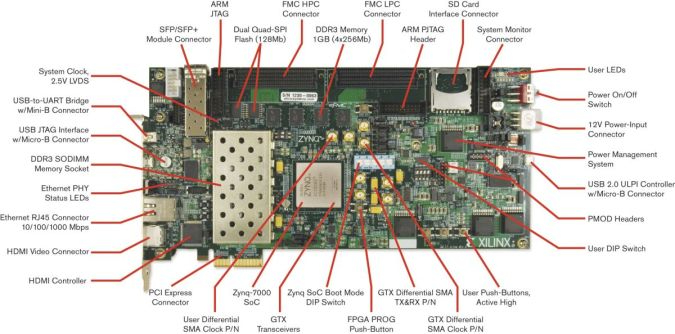

.. imported from: https://wiki.analog.com/resources/eval/user-guides/adrv9009/quickstart/zc706

.. _adrv9009 quickstart zc706:

ZC706 Quick Start Guide
================================================================================

This guide provides some quick instructions on how to setup the
:adi:`ADRV9009-W/PCBZ <EVAL-ADRV9008-9009>` on:

- :xilinx:`ZC706`

.. esd-warning::

Using Linux as software
--------------------------------------------------------------------------------

Necessary files
~~~~~~~~~~~~~~~~~~~~~~~~~~~~~~~~~~~~~~~~~~~~~~~~~~~~~~~~~~~~~~~~~~~~~~~~~~~~~~~~

.. note::

  The SD card includes several folders in the root directory of the BOOT
  partition. In order to configure the SD card to work with a specific FPGA
  board and ADI hardware, several files must be copied onto the root directory.
  Using the host PC, drag and drop the required files onto the BOOT partition,
  and use the EJECT function when removing the SD card from the reader.

The following files are needed for the system to boot:

- HDL boot image: ``BOOT.BIN``
- Linux Kernel image: ``uImage``
- Linux device tree: ``devicetree.dtb``

They can either be taken from the SD card -- already generated by us, or you
can build them manually:

- Instructions on how to choose the boot files from the SD card can be found in
  the **Platform-Specific Manual Steps** section from here:
  :external+kuiper:ref:`hardware-configuration`.
- Instructions on how to manually build the boot files from source can be found
  here:

   - :ref:`linux-kernel zynq`
   - :dokuwiki:`ADRV9009 HDL Reference Design
     <resources/eval/user-guides/adrv9009/reference_hdl>`.
     More HDL build details at :external+hdl:ref:`build_hdl`

.. important::

  Some projects provide multiple devicetree files in the SD card's boot
  folders. Make sure you select the devicetree that matches your specific use
  case.

Required Software
~~~~~~~~~~~~~~~~~~~~~~~~~~~~~~~~~~~~~~~~~~~~~~~~~~~~~~~~~~~~~~~~~~~~~~~~~~~~~~~~

- SD Card 16GB imaged with :external+kuiper:doc:`Kuiper <index>`
- A UART terminal (Putty/Tera Term/Minicom, etc.) with baud rate 115200 (8N1)

Required Hardware
~~~~~~~~~~~~~~~~~~~~~~~~~~~~~~~~~~~~~~~~~~~~~~~~~~~~~~~~~~~~~~~~~~~~~~~~~~~~~~~~

- :xilinx:`ZC706` FPGA board and its power supply
- :adi:`ADRV9009-W/PCBZ <EVAL-ADRV9008-9009>` FMC evaluation board
- SD card with at least 16GB of memory
- (Optional) 2x SMA cable for analog signal loopback
- (Optional) External clock generator
- Mini-USB cable (UART)
- (Optional) Ethernet cable
- (Optional) USB keyboard & mouse and a HDMI compatible monitor

More details as to why you need these, can be found at
:ref:`adrv9009 prerequisites`.

Testing
~~~~~~~~~~~~~~~~~~~~~~~~~~~~~~~~~~~~~~~~~~~~~~~~~~~~~~~~~~~~~~~~~~~~~~~~~~~~~~~~

Creating the setup
^^^^^^^^^^^^^^^^^^^^^^^^^^^^^^^^^^^^^^^^^^^^^^^^^^^^^^^^^^^^^^^^^^^^^^^^^^^^^^^^

.. image:: ../images/adrv9009_zc706_quickstart.jpg
   :width: 800

.. caution::

    This project was tested with **VADJ = 2.5 V**

Follow the steps in this order, to avoid damaging the components:

#. Connect the :adi:`ADRV9009-W/PCBZ <EVAL-ADRV9008-9009>` FMC board to the
   :xilinx:`ZC706` **FMC HPC** connector
#. Insert SD card into the SD card socket on the FPGA (J30)
#. Configure the :xilinx:`ZC706` for SD card boot mode (**SW11[1:5]** in
   position **Down, Down, Up, Up, Down**, as shown in the picture below)

   .. image:: ../../images/zc706_boot_config.png
      :width: 600

#. Connect USB UART (Mini-USB) to your host PC (J21)
#. (Optional) Connect the external clock generator and/or loopback cables
#. (Optional) Plug-in an Ethernet cable from your router/switch to the Ethernet
   port on the FPGA board
#. (Optional) Connect a monitor to the FPGA by HDMI, and a mouse and a keyboard
#. Plug in the power supply and turn on the power switch on the FPGA board
#. Observe Kernel and serial console output messages on your terminal (use the
   first ttyUSB or COM port registered)

Booting the System
^^^^^^^^^^^^^^^^^^^^^^^^^^^^^^^^^^^^^^^^^^^^^^^^^^^^^^^^^^^^^^^^^^^^^^^^^^^^^^^^

After turning on the power switch the following messages should appear on the
serial console:

.. collapsible:: Complete kernel boot log (Click to expand)

   ::

      U-Boot 2018.01-21439-gd244ce5 (Jul 29 2021 - 16:31:12 +0100) Xilinx Zynq ZC706, Build: jenkins-development-build_uboot-1

      Model: Zynq ZC706 Development Board
      Board: Xilinx Zynq
      Silicon: v3.1
      I2C:   ready
      DRAM:  ECC disabled 1 GiB
      MMC:   sdhci@e0100000: 0 (SD)
      SF: Detected s25fl128s_64k with page size 512 Bytes, erase size 128 KiB, total 32 MiB
      *** Warning - bad CRC, using default environment

      In:    serial@e0001000
      Out:   serial@e0001000
      Err:   serial@e0001000
      Net:   ZYNQ GEM: e000b000, phyaddr 7, interface rgmii-id
      eth0: ethernet@e000b000
      reading uEnv.txt
      407 bytes read in 16 ms (24.4 KiB/s)
      Importing environment from SD ...
      Hit any key to stop autoboot:  0
      Device: sdhci@e0100000
      Manufacturer ID: 27
      OEM: 5048
      Name: SD16G
      Tran Speed: 50000000
      Rd Block Len: 512
      SD version 3.0
      High Capacity: Yes
      Capacity: 14.4 GiB
      Bus Width: 4-bit
      Erase Group Size: 512 Bytes
      reading uEnv.txt
      407 bytes read in 16 ms (24.4 KiB/s)
      Loaded environment from uEnv.txt
      Importing environment from SD ...
      Running uenvcmd ...
      Copying Linux from SD to RAM...
      reading uImage
      6985272 bytes read in 411 ms (16.2 MiB/s)
      reading devicetree.dtb
      43645 bytes read in 30 ms (1.4 MiB/s)
      ** Unable to read file uramdisk.image.gz **
      ## Booting kernel from Legacy Image at 03000000 ...
         Image Name:   Linux-5.10.0-97902-g12401977df5e
         Image Type:   ARM Linux Kernel Image (uncompressed)
         Data Size:    6985208 Bytes = 6.7 MiB
         Load Address: 00008000
         Entry Point:  00008000
         Verifying Checksum ... OK
      ## Flattened Device Tree blob at 02a00000
         Booting using the fdt blob at 0x2a00000
         Loading Kernel Image ... OK
         Loading Device Tree to 1fff2000, end 1ffffa7c ... OK

      Starting kernel ...

      Booting Linux on physical CPU 0x0
      Linux version 5.10.0-97902-g12401977df5e (jenkins@romlxbuild1.adlk.analog.com)
      (arm-xilinx-linux-gnueabi-gcc.real (GCC) 10.2.0, GNU ld (GNU Binutils) 2.35.0.20200730)
      #4050 SMP PREEMPT Tue Dec 14 06:49:30 GMT 2021
      CPU: ARMv7 Processor [413fc090] revision 0 (ARMv7), cr=18c5387d
      CPU: PIPT / VIPT nonaliasing data cache, VIPT aliasing instruction cache
      OF: fdt: Machine model: Xilinx Zynq ZC706
      Memory policy: Data cache writealloc
      cma: Reserved 128 MiB at 0x38000000
      Zone ranges:
        Normal   [mem 0x0000000000000000-0x000000002fffffff]
        HighMem  [mem 0x0000000030000000-0x000000003fffffff]
      Movable zone start for each node
      Early memory node ranges
        node   0: [mem 0x0000000000000000-0x000000003fffffff]
      Initmem setup node 0 [mem 0x0000000000000000-0x000000003fffffff]
      jesd204: created con: id=0, topo=0, link=0, /axi/spi@e0006000/ad9528-1@0 <-> /fpga-axi@0/axi-adxcvr-tx@44a80000
      jesd204: created con: id=1, topo=0, link=2, /axi/spi@e0006000/ad9528-1@0 <-> /fpga-axi@0/axi-adxcvr-rx-os@44a50000
      jesd204: created con: id=2, topo=0, link=1, /axi/spi@e0006000/ad9528-1@0 <-> /fpga-axi@0/axi-adxcvr-rx@44a60000
      jesd204: found 9 devices and 1 topologies
      adrv9009 spi0.1: adrv9009_probe : enter
      adrv9009 spi0.1: adrv9009_info: adrv9009 Rev 192, Firmware 6.0.2 API version:
      3.6.0.5 successfully initialized via jesd204-fsm
      axi_sysid 45000000.axi-sysid-0: AXI System ID core version (1.01.a) found
      fpga_manager fpga0: Xilinx Zynq FPGA Manager registered
      cf_axi_dds 44a04000.axi-adrv9009-tx-hpc: Analog Devices CF_AXI_DDS_DDS MASTER (9.02.b) at 0x44A04000, probed DDS AD9371
      cf_axi_adc 44a00000.axi-adrv9009-rx-hpc: ADI AIM (10.03.) at 0x44A00000 probed ADC ADRV9009 as MASTER

      systemd[1]: Detected architecture arm.

      Welcome to Kuiper GNU/Linux 10 (buster)!

      Raspbian GNU/Linux 10 analog ttyPS0

      analog login: root (automatic login)

      root@analog:~#

Useful commands for the serial terminal
^^^^^^^^^^^^^^^^^^^^^^^^^^^^^^^^^^^^^^^^^^^^^^^^^^^^^^^^^^^^^^^^^^^^^^^^^^^^^^^^

The below commands are to be run in the serial terminal connected to the FPGA.

To find out the IP of the FPGA board, run the following command and take the IP
specified at "eth0 inet":

.. shell::

   $ifconfig

To see the IIO devices detected, run:

.. shell::

   root@analog:~# iio_info | grep :device
   iio:device0: ad7291
   iio:device1: xadc
   iio:device2: ad9528-1
   iio:device3: adrv9009-phy
   iio:device4: axi-adrv9009-rx-obs-hpc (buffer capable)
   iio:device5: axi-adrv9009-tx-hpc (buffer capable)
   iio:device6: axi-adrv9009-rx-hpc (buffer capable)

To use the :dokuwiki:`JESD204 status utility <resources/tools-software/linux-software/jesd_status>`,
run:

.. shell::

   $jesd_status

To power off the system, run the following command, and wait for the final
message to be printed, then power off the FPGA board from the switch as well.

.. shell::

   $poweroff

To reboot the system, run:

.. shell::

   $reboot

.. important::

   Even thought this is Linux, this is a persistent file systems. Care should
   be taken not to corrupt the file system -- please shut down things, don't
   just turn off the power switch. Depending on your monitor, the standard
   power off could be hiding. You can do this from the terminal as well with
   :code:`sudo shutdown -h now` or the above-mentioned command for powering
   off.
